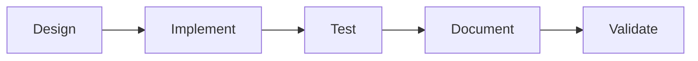

# CLAUDE.md

This file provides guidance to Claude Code (claude.ai/code) when working with code in this repository.

## Project Overview

VilnaCRM Core Service - A modern PHP microservice template built with Symfony 7, API Platform 4, and MongoDB. This service follows Hexagonal Architecture (Ports & Adapters), Domain-Driven Design (DDD), and CQRS patterns.

## 🎯 Skills & Workflows

This project uses **modular skills** for specialized tasks. Skills are automatically discovered from `.claude/skills/`.

### Quick Skill Guide

| Task Type                  | Skill                           | When to Use                               |
| -------------------------- | ------------------------------- | ----------------------------------------- |
| **Fix Deptrac violations** | `deptrac-fixer`                 | Architecture boundary violations detected |
| **Fix complexity issues**  | `complexity-management`         | PHPInsights complexity score drops        |
| **Run CI checks**          | `ci-workflow`                   | Before committing, validating changes     |
| **Debug test failures**    | `testing-workflow`              | PHPUnit, Behat, or Infection issues       |
| **Handle PR feedback**     | `code-review`                   | Processing code review comments           |
| **Create DDD patterns**    | `implementing-ddd-architecture` | New entities, value objects, aggregates   |
| **Add CRUD endpoints**     | `api-platform-crud`             | New API resources with full CRUD          |
| **Create load tests**      | `load-testing`                  | K6 performance tests (REST/GraphQL)       |
| **Update entity schema**   | `database-migrations`           | Modifying entities, adding fields         |
| **Document APIs**          | `developing-openapi-specs`      | OpenAPI endpoint factories                |
| **Sync documentation**     | `documentation-sync`            | After any code changes                    |
| **Quality overview**       | `quality-standards`             | Understanding protected thresholds        |

> **📋 Detailed Guide**: See `.claude/skills/SKILL-DECISION-GUIDE.md` for decision trees and scenarios.

## 🛡️ Quality Standards (Protected Thresholds)

This project enforces **strict quality thresholds** that MUST NOT be lowered:

| Tool              | Metric       | Required | Skill for Issues        |
| ----------------- | ------------ | -------- | ----------------------- |
| **PHPInsights**   | Complexity   | 94% min  | `complexity-management` |
| **PHPInsights**   | Quality      | 100%     | `complexity-management` |
| **PHPInsights**   | Architecture | 100%     | `deptrac-fixer`         |
| **PHPInsights**   | Style        | 100%     | Run `make phpcsfixer`   |
| **Deptrac**       | Violations   | 0        | `deptrac-fixer`         |
| **Psalm**         | Errors       | 0        | Fix reported issues     |
| **Test Coverage** | Lines        | High %   | `testing-workflow`      |
| **Infection MSI** | Score        | High %   | `testing-workflow`      |

> **⚠️ NEVER lower thresholds**. Always fix code to meet standards. See `quality-standards` skill for details.

## Development Commands

### Quick Reference Table

| Category         | Command                      | Description             | Related Skill              |
| ---------------- | ---------------------------- | ----------------------- | -------------------------- |
| **Docker**       | `make start`                 | Start containers        | -                          |
|                  | `make sh`                    | Access PHP container    | -                          |
| **Quality**      | `make phpcsfixer`            | Fix code style          | -                          |
|                  | `make psalm`                 | Static analysis         | -                          |
|                  | `make phpinsights`           | Quality checks          | `complexity-management`    |
|                  | `make deptrac`               | Architecture validation | `deptrac-fixer`            |
| **Testing**      | `make unit-tests`            | Unit tests only         | `testing-workflow`         |
|                  | `make integration-tests`     | Integration tests       | `testing-workflow`         |
|                  | `make e2e-tests`             | Behat E2E tests         | `testing-workflow`         |
|                  | `make all-tests`             | All functional tests    | `testing-workflow`         |
|                  | `make infection`             | Mutation testing        | `testing-workflow`         |
| **Load Testing** | `make smoke-load-tests`      | Minimal load test       | `load-testing`             |
|                  | `make load-tests`            | All load tests          | `load-testing`             |
| **CI**           | `make ci` (if exists)        | Run all CI checks       | `ci-workflow`              |
| **Database**     | `make setup-test-db`         | Reset test MongoDB      | `database-migrations`      |
| **API Docs**     | `make generate-openapi-spec` | Export OpenAPI          | `developing-openapi-specs` |

### Detailed Commands

<details>
<summary>Docker Environment</summary>

```bash
make start          # Start docker containers
make stop           # Stop docker containers
make down           # Stop and remove containers
make build          # Build docker images from scratch
make sh             # Access PHP container shell
make logs           # Show all logs
make new-logs       # Show live logs
```

</details>

<details>
<summary>Dependency Management</summary>

```bash
make install        # Install dependencies from composer.lock
make update         # Update dependencies per composer.json
```

</details>

<details>
<summary>Code Quality & Static Analysis</summary>

```bash
make phpcsfixer     # Auto-fix PHP coding standards
make psalm          # Run Psalm static analysis
make psalm-security # Run Psalm security/taint analysis
make phpinsights    # Run PHP quality checks
make deptrac        # Validate architectural boundaries
make composer-validate  # Validate composer files
```

</details>

<details>
<summary>Testing</summary>

```bash
make unit-tests          # Run unit tests only
make integration-tests   # Run integration tests only
make e2e-tests          # Run Behat end-to-end tests (alias: make behat)
make all-tests          # Run unit, integration, and e2e tests
make tests-with-coverage # Run tests with coverage report
make infection          # Run mutation testing

# Setup test database
make setup-test-db      # Drop and recreate test MongoDB schema
```

</details>

<details>
<summary>Load Testing</summary>

```bash
make smoke-load-tests   # Minimal load test
make average-load-tests # Average load test
make stress-load-tests  # High load test
make spike-load-tests   # Spike/extreme load test
make load-tests         # Run all load tests

# AWS-based load testing
make aws-load-tests         # Execute load tests on AWS
make aws-load-tests-cleanup # Clean up AWS resources
```

</details>

<details>
<summary>Symfony Commands</summary>

```bash
make cache-clear    # Clear Symfony cache
make cache-warmup   # Warmup cache
make commands       # List all Symfony console commands
```

</details>

<details>
<summary>API Documentation</summary>

```bash
make generate-openapi-spec   # Export OpenAPI spec to .github/openapi-spec/spec.yaml
make generate-graphql-spec   # Export GraphQL spec to .github/graphql-spec/spec
```

</details>

## Architecture

### Directory Structure

````text
src/
├── Customer/              # Customer bounded context
│   └── Domain/
│       └── Entity/        # Domain entities
├── Internal/              # Internal services (e.g., HealthCheck)
└── Shared/                # Shared kernel
    ├── Application/       # Application layer (DTOs, transformers, processors, resolvers)
    ├── Domain/            # Domain layer (aggregates, entities, value objects, events, commands)
    └── Infrastructure/    # Infrastructure layer (repositories, bus implementations, Doctrine types)
```text

### Layered Architecture (Hexagonal/DDD)

**Skill**: Use `implementing-ddd-architecture` for design patterns and `deptrac-fixer` for violations.

The codebase enforces strict architectural boundaries via Deptrac:

| Layer | Purpose | Contains | Dependencies |
|-------|---------|----------|--------------|
| **Domain** | Pure business logic | Entities, Value Objects, Aggregates, Events, Commands (interfaces), Repository interfaces | None (isolated) |
| **Application** | Use cases & orchestration | Command Handlers, Event Subscribers, DTOs, Transformers, Processors, Resolvers | Domain + Infrastructure |
| **Infrastructure** | External concerns | Repository implementations (MongoDB), Message buses (Symfony), Doctrine types, Retry strategies | Domain + Application |

**Dependency Rules** (Enforced by Deptrac):
- ✅ Domain → No dependencies (pure)
- ✅ Application → Domain + Infrastructure
- ✅ Infrastructure → Domain + Application
- ❌ Domain → Application/Infrastructure (VIOLATION)

**Common Patterns**:
- Aggregates extend `AggregateRoot` for domain events
- Commands implement `CommandInterface`
- Handlers implement `CommandHandlerInterface`
- Events extend `DomainEvent`
- Subscribers implement `DomainEventSubscriberInterface`

### CQRS & Event-Driven Design

**Skill**: Use `implementing-ddd-architecture` for implementation patterns.

| Component | Interface | Tag | Purpose |
|-----------|-----------|-----|---------|
| **Commands** | `CommandInterface` | - | Write operations |
| **Command Handlers** | `CommandHandlerInterface` | `app.command_handler` | Execute commands |
| **Domain Events** | Extend `DomainEvent` | - | Record state changes |
| **Event Subscribers** | `DomainEventSubscriberInterface` | `app.event_subscriber` | React to events |
| **Aggregates** | Extend `AggregateRoot` | - | Record and pull events |

**Flow**: Command → Handler → Aggregate → Domain Events → Subscribers

### Service Registration (Auto-Configured)

Services in `config/services.yaml` are auto-configured:

| Pattern | Auto-Wiring | Tag |
|---------|-------------|-----|
| All classes in `src/` | ✅ Yes | - |
| Command handlers | ✅ Yes | `app.command_handler` (via `_instanceof`) |
| Event subscribers | ✅ Yes | `app.event_subscriber` (via `_instanceof`) |
| OpenAPI factories | ✅ Yes | `app.openapi_endpoint_factory` (via `_instanceof`) |

### API Platform & MongoDB

**Skills**: `api-platform-crud` for endpoints, `database-migrations` for schema, `developing-openapi-specs` for docs.

| Component | Technology | Location | Notes |
|-----------|-----------|----------|-------|
| **Database** | MongoDB (Doctrine ODM) | - | NoSQL document store |
| **Custom Types** | ULID, Domain UUID | `Shared/Infrastructure/DoctrineType` | Custom field types |
| **Mappings** | XML-based | `config/doctrine/*.orm.xml` | Entity configuration |
| **Resource Classes** | Auto-discovery | `src/{Context}/Domain/Entity` | Configured in `api_platform.yaml` |
| **Filters** | API Platform | `services.yaml` | OrderFilter, SearchFilter, RangeFilter, DateFilter, BooleanFilter |

### API Formats

| Format | MIME Type | Purpose |
|--------|-----------|---------|
| **JSON-LD** | `application/ld+json` | Primary API format |
| **JSON Problem** | `application/problem+json` | Error responses (RFC 7807) |
| **GraphQL** | - | API Platform GraphQL |

### Testing Structure

**Skill**: Use `testing-workflow` for functional tests, `load-testing` for performance tests.

| Test Type | Tool | Directory | Environment Variable | Purpose |
|-----------|------|-----------|---------------------|---------|
| **Unit** | PHPUnit | `tests/Unit/` | `PHPUNIT_TESTSUITE=Unit` | Isolated component testing |
| **Integration** | PHPUnit | `tests/Integration/` | `PHPUNIT_TESTSUITE=Integration` | Component interaction testing |
| **E2E (BDD)** | Behat | `tests/Behat/` | - | User scenario testing |
| **Load** | k6 | `tests/Load/` | - | Performance/stress testing |
| **CLI** | bats | `tests/CLI/` | - | Bash script testing |

**Configuration**:
- Behat contexts: `behat.yml.dist`
- Load tests: Run in Docker with k6
- Coverage: PHPUnit with Xdebug/PCOV

## 🔄 Common Workflows

### New Feature Development (Full Workflow)



1. **Design Domain Model** → Use `implementing-ddd-architecture` skill
2. **Create API Endpoint** → Use `api-platform-crud` skill
3. **Configure Database** → Use `database-migrations` skill
4. **Write Tests** → Use `testing-workflow` skill
5. **Update Documentation** → Use `documentation-sync` skill
6. **Run CI Validation** → Use `ci-workflow` skill

### Fixing Quality Issues

| Issue | First Step | Skill |
|-------|------------|-------|
| Deptrac fails | Read violation message | `deptrac-fixer` |
| Complexity too high | Identify complex method | `complexity-management` |
| Tests failing | Run specific test suite | `testing-workflow` |
| CI pipeline red | Check which step failed | `ci-workflow` |

### Code Review Process

1. Fetch PR comments → Use `code-review` skill
2. Address feedback → Use relevant implementation skills
3. Run quality checks → Use `ci-workflow` skill
4. Update documentation → Use `documentation-sync` skill

## 📐 Important Patterns

### Creating a New Entity

**Skills**: `implementing-ddd-architecture` + `database-migrations`

1. Define entity in `{Context}/Domain/Entity/` (see DDD skill for patterns)
2. Create XML mapping in `config/doctrine/{Entity}.orm.xml`
3. Add API Platform attributes/configuration to entity
4. Register resource class directory in `config/packages/api_platform.yaml`
5. Run `make setup-test-db` to verify schema

**Example**: See `.claude/skills/api-platform-crud/examples/complete-customer-crud.md`

### Adding a Command Handler (CQRS Pattern)

**Skills**: `implementing-ddd-architecture`

1. Create command implementing `CommandInterface` in `{Context}/Application/Command/`
2. Create handler implementing `CommandHandlerInterface` in `{Context}/Application/CommandHandler/`
3. Handler auto-tagged with `app.command_handler` and registered
4. Dispatch via command bus: `$this->commandBus->dispatch($command)`

### Working with Aggregates & Domain Events

**Skills**: `implementing-ddd-architecture`

1. Extend `App\Shared\Domain\Aggregate\AggregateRoot`
2. Record events: `$this->record(new CustomerCreatedEvent(...))`
3. Pull events in handler: `$events = $aggregate->pullDomainEvents()`
4. Dispatch events via event bus

### Custom API Filters

Define filters in `config/services.yaml` inheriting from API Platform's built-in filters. Tag with `api_platform.filter` and assign an ID.

**Available Filters**: OrderFilter, SearchFilter, RangeFilter, DateFilter, BooleanFilter

## PHP Configuration

- **PHP Version**: 8.3.12 (minimum 8.2)
- **Extensions Required**: ctype, dom, iconv, mbstring, simplexml, xml
- **Memory Limit**: `-1` (unlimited) for coverage and infection testing

## 🚀 CI/CD Pipeline

### Quality Gates (All Must Pass)

| Check | Tool | Threshold | Skill on Failure |
|-------|------|-----------|------------------|
| Code Style | PHP CS Fixer | PSR-12 | Run `make phpcsfixer` |
| Static Analysis | Psalm | 0 errors | Review Psalm output |
| Security Analysis | Psalm Taint | 0 issues | Fix tainted flows |
| Quality Score | PHPInsights | 100% Q/A/S, 94% C | `complexity-management` |
| Architecture | Deptrac | 0 violations | `deptrac-fixer` |
| Unit Tests | PHPUnit | All pass | `testing-workflow` |
| Integration Tests | PHPUnit | All pass | `testing-workflow` |
| E2E Tests | Behat | All pass | `testing-workflow` |
| Mutation Testing | Infection | High MSI | `testing-workflow` |
| Dependencies | Composer | Valid | Run `make composer-validate` |
| Security Audit | Symfony CLI | No vulnerabilities | Update dependencies |

**Run All Checks**: Use `ci-workflow` skill before committing.

### Pre-Commit Workflow

```bash
# Recommended before every commit:
make phpcsfixer          # Fix code style
make psalm               # Check static analysis
make deptrac             # Validate architecture
make all-tests           # Run all tests
make phpinsights         # Verify quality scores
```

Or use `ci-workflow` skill to run comprehensive checks.

## 🔧 Environment Variables

Key environment variables are defined in `.env` and `.env.test`:

| Variable | Purpose | Example |
|----------|---------|---------|
| `APP_ENV` | Application environment | `dev`, `test`, `prod` |
| `DB_URL` | MongoDB connection string | `mongodb://mongo:27017` |
| `AWS_SQS_*` | AWS SQS message queue config | Various AWS settings |

## 📚 Additional Resources

### Project Structure
- **Kernel**: `src/Shared/Kernel.php`
- **Preload**: `config/preload.php`
- **API Docs**: `https://localhost/api/docs` (after `make start`)
- **Git Hooks**: Configured in `captainhook.json`
- **Commits**: Conventional commits enforced

### Skill Documentation
- **Decision Guide**: `.claude/skills/SKILL-DECISION-GUIDE.md`
- **DDD Reference**: `.claude/skills/implementing-ddd-architecture/REFERENCE.md`
- **API Examples**: `.claude/skills/api-platform-crud/examples/`
- **Load Test Patterns**: `.claude/skills/load-testing/`

### Key Principles

1. **Never lower quality thresholds** - Always improve code quality
2. **Respect architectural boundaries** - Use Deptrac as your guide
3. **Test-driven development** - Write tests for new features
4. **Domain-driven design** - Keep domain logic pure
5. **Documentation sync** - Update docs with code changes
6. **Use skills proactively** - Reference `.claude/skills/SKILL-DECISION-GUIDE.md`

---

**For detailed workflows, patterns, and troubleshooting** → See modular skills in `.claude/skills/` directory.
````
