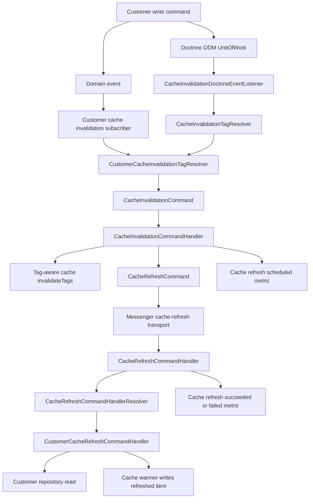

# Design and Architecture

The Core Service is architected around several foundational design principles, each contributing to the system's robustness, scalability, and maintainability. Below, we delve into how these principles are reflected in the codebase and folder structure.

## Domain-Driven Design (DDD)

DDD is an approach to software development that aims to align the implementation of complex systems with the domain they are intended to serve. It emphasizes collaboration between domain experts, software developers, and other stakeholders to iteratively refine the conceptual model of the domain and translate it into a well-designed software system.

### Dividing codebase into bounded contexts:

Dividing a codebase into bounded contexts allows for better organization and management of complexity in large systems. Each bounded context represents a specific area of the domain and encapsulates its models, language, and rules. This approach offers several benefits:

- **Clearer Understanding:** Bounded contexts provide clear boundaries for different parts of the system, making it easier for developers to understand and reason about each component independently.
- **Isolation of Complexity:** By isolating complexity within bounded contexts, changes and updates to one part of the system are less likely to have unintended consequences on other parts.
- **Scalability:** Bounded contexts can be developed, deployed, and scaled independently, allowing teams to work autonomously and efficiently.

Currently, we have 3 bounded contexts in Core Service:

1. **Shared**: Provides foundational support across the service.
2. **Core/Customer**: Encompasses the customer management system, including customer types and statuses.
3. **Internal/HealthCheck**: Handles system health monitoring functionality.

### Having a predictable structure for each bounded context:

In DDD, each bounded context typically follows a predictable structure consisting of three main layers: Domain, Application, and Infrastructure.

#### Domain Layer:

The Domain Layer encapsulates the core business logic and rules of the bounded context. It represents the heart of the application and contains domain entities, value objects, and aggregates. The purpose of the Domain Layer is to model and implement the concepts, behaviors, and relationships relevant to the specific domain it serves. By focusing on the domain logic, this layer ensures that the software system accurately reflects the problem domain and enforces the business rules effectively.

#### Application Layer:

The Application Layer sits between the Domain Layer and the external interfaces of the system. It orchestrates interactions between the domain objects and the outside world, handling requests, executing use cases, and coordinating the flow of data and control. Within the Application Layer, application services define the use cases and business workflows of the bounded context. These services coordinate the execution of domain logic by interacting with domain objects and enforcing business rules. By separating application-specific concerns from the domain logic, the Application Layer promotes maintainability, testability, and flexibility in the system.

#### Infrastructure Layer:

The Infrastructure Layer provides implementations for external concerns such as persistence, communication, and integration with external systems. It serves as the bridge between the application and the underlying infrastructure components, including databases, message queues, APIs, and third-party services. The Infrastructure Layer includes components such as repositories, data access objects, external service clients, and communication adapters. These components abstract away the details of interacting with external systems, allowing the application to focus on its core domain logic. By decoupling the application from its infrastructure dependencies, the Infrastructure Layer facilitates portability, scalability, and maintainability of the system.

By following this predictable structure for each bounded context, teams can maintain consistency and clarity throughout the codebase, making it easier to understand, modify, and extend the system over time.

## Hexagonal Architecture

Hexagonal Architecture, also known as Ports and Adapters Architecture, is a software design pattern that promotes loose coupling and separation of concerns in systems. In this architectural style, the core business logic of an application is encapsulated within the innermost layer, often referred to as the "hexagon" or "core." This core does not depend on any external systems or interfaces, making it highly testable and independent.

The key concept of Hexagonal Architecture is the distinction between the application's core business logic and its external interfaces, such as databases, user interfaces, or external services. These external interfaces are represented by ports, which define the contract or interface that the core logic interacts with. Adapters are then used to connect these ports to the external systems, translating between the core's interface and the specific technology used by the external system.

For Core Service, it means, that the Domain layer in each bounded context, discussed above, stays independent from any external dependencies. For example, Core Service can work with HTTP and GraphQL requests, but business logic stays the same, since it is encapsulated in the Domain layer, and does not depend on the type of request being made. Also, the way of storing data can be easily changed by introducing new Repositories in the Infrastructure layer, because there is no dependency on a specific way of saving data.

## Command Query Responsibility Segregation (CQRS)

CQRS is a design pattern that separates the responsibilities of handling commands (write operations) and queries (read operations) into distinct components. In a CQRS architecture, the system's data model is split into separate models optimized for reads and writes, allowing for more efficient data access and processing.

### How it's implemented

In Core Service, CQRS allows us to encapsulate behavior and reuse it in different scenarios. Commands have all the needed data for instructions, that were encapsulated, to be completed. After being dispatched, they are automatically processed by corresponding handlers.

All interfaces related to Commands can be found in `Shared/Domain/Bus/Command`.

This is the list of currently available Commands, which can be found in `Core/Customer/Application/Command` folder:

1. **CreateCustomerCommand**: Dispatched to create a new customer.
2. **UpdateCustomerCommand**: Dispatched to update an existing customer.
3. **CreateTypeCommand**: Dispatched to create a new customer type.
4. **UpdateCustomerTypeCommand**: Dispatched to update an existing customer type.
5. **CreateStatusCommand**: Dispatched to create a new customer status.
6. **UpdateCustomerStatusCommand**: Dispatched to update an existing customer status.

Also, you can find Handlers for these commands in `Core/Customer/Application/CommandHandler`, and a Message Bus for them in `Shared/Infrastructure/Bus/Command`.

## Event-Driven Architecture

Event-driven architecture is a design pattern that emphasizes the use of events to trigger and communicate changes within a system. In an Event-Driven Architecture, components communicate asynchronously through the exchange of events, allowing for loosely coupled and scalable systems.

### How it's implemented

In Core Service, we use Domain Events to have a flexible way to extend our system. Domain Events can be published from the Domain layer, and then consumed by any amount of Subscribers, which gives an opportunity to easily add new functionality.

All interfaces and Abstract classes related to Domain Events can be found in `Shared/Domain/Bus/Event`.

This is the list of currently available Domain Events:

1. **HealthCheckEvent**: Published during system health verification to check database, cache, and broker connectivity.

Also, you can find Subscribers for these events in `Internal/HealthCheck/Application/EventSub`, and a Message Bus for them in `Shared/Infrastructure/Bus/Event`.

## Shared Cache Invalidation and Refresh

Core Service uses a reusable cache invalidation and refresh pipeline. The shared code lives in the existing `Shared/Application` and `Shared/Infrastructure` layers, while each bounded context contributes adapters for its own cache tags, policies, targets, and warmers. Customer is the first adapter, but the design is not customer-specific.

Writes never synchronously recompute cached repository entries. They invalidate affected tags on a best-effort basis and schedule refresh commands for async workers. If cache invalidation or refresh scheduling fails, the write path logs the failure and continues; TTLs and later reads still provide eventual recovery. Deletes use `invalidate_only` refresh commands so removed resources are not warmed back into cache.



The source tree follows the repository's existing one-directory-per-class-type convention. There is no new bounded-context or Customer cache directory; shared cache helpers stay in the existing `Shared/Infrastructure/Cache` directory, while orchestration abstractions are placed with other application commands, DTOs, resolvers, handlers, infrastructure collections, and listeners.

The async transports use Symfony Messenger with `symfony/amazon-sqs-messenger`. Local development uses LocalStack queue-name DSNs such as `sqs://localstack:4566/cache-refresh?sslmode=disable&region=us-east-1&access_key=fake&secret_key=fake`, allowing Messenger to auto-create queues without AWS metadata lookup.

```text
src/
├── Shared/
│   ├── Application/
│   │   ├── Command/
│   │   │   ├── CacheInvalidationCommand.php
│   │   │   └── CacheRefreshCommand.php
│   │   ├── CommandHandler/
│   │   │   ├── CacheRefreshCommandHandlerBase.php
│   │   │   ├── CacheInvalidationCommandHandler.php
│   │   │   └── CacheRefreshCommandHandler.php
│   │   ├── Exception/
│   │   │   └── UnsupportedCacheRefreshPolicyException.php
│   │   ├── DTO/
│   │   │   ├── CacheChangeSet.php
│   │   │   ├── CacheFieldChange.php
│   │   │   ├── CacheInvalidationRule.php
│   │   │   ├── CacheInvalidationTagSet.php
│   │   │   ├── CacheRefreshPolicy.php
│   │   │   ├── CacheRefreshResult.php
│   │   │   └── CacheRefreshTarget.php
│   │   ├── EventSubscriber/
│   │   │   └── AbstractCacheInvalidationSubscriber.php
│   │   ├── Factory/
│   │   │   └── AbstractCacheRefreshCommandFactory.php
│   │   ├── Observability/Metric/
│   │   │   ├── CacheHitMetric.php
│   │   │   ├── CacheMissMetric.php
│   │   │   ├── CacheRefreshFailedMetric.php
│   │   │   ├── CacheRefreshScheduledMetric.php
│   │   │   ├── CacheRefreshStaleServedMetric.php
│   │   │   ├── CacheRefreshSucceededMetric.php
│   │   │   └── ValueObject/CacheRefreshMetricDimensions.php
│   │   └── Resolver/
│   │       ├── CachePoolResolverInterface.php
│   │       ├── CacheRefreshCommandHandlerResolverInterface.php
│   │       ├── CacheRefreshPolicyResolverInterface.php
│   │       ├── CacheRefreshTargetResolverInterface.php
│   │       └── DocumentCacheInvalidationResolverInterface.php
│   └── Infrastructure/
│       ├── Cache/
│       │   └── CacheKeyBuilder.php
│       ├── Collection/
│       │   ├── CacheInvalidationRuleCollection.php
│       │   ├── CacheRefreshCommandCollection.php
│       │   ├── CacheRefreshCommandHandlerCollection.php
│       │   ├── CacheRefreshPolicyCollection.php
│       │   └── CacheRefreshTargetResolverCollection.php
│       ├── EventListener/
│       │   └── CacheInvalidationDoctrineEventListener.php
│       └── Resolver/
│           ├── CachePoolResolver.php
│           ├── CacheInvalidationTagResolver.php
│           ├── CacheRefreshCommandHandlerResolver.php
│           └── CacheRefreshPolicyResolver.php
└── Core/
    └── Customer/
        ├── Application/
        │   ├── CommandHandler/
        │   │   └── CustomerCacheRefreshCommandHandler.php
        │   ├── EventSubscriber/
        │   │   ├── CustomerCreatedCacheInvalidationSubscriber.php
        │   │   ├── CustomerDeletedCacheInvalidationSubscriber.php
        │   │   └── CustomerUpdatedCacheInvalidationSubscriber.php
        │   └── Factory/
        │       └── CustomerCacheRefreshCommandFactory.php
        └── Infrastructure/
            ├── Collection/
            │   ├── CustomerCacheInvalidationRuleCollection.php
            │   ├── CustomerCachePolicyCollection.php
            │   └── CustomerCacheTagCollection.php
            ├── Repository/
            │   └── CachedCustomerRepository.php
            └── Resolver/
                ├── CustomerCachePolicyResolver.php
                ├── CustomerCacheInvalidationTagResolver.php
                ├── CustomerCacheRefreshTargetResolver.php
                └── CustomerCacheTagResolver.php
```

The shared handler and resolver classes are registered through service tags:

- `app.cache_invalidation_resolver` for context-specific document invalidation resolvers.
- `app.cache_refresh_handler` for context-specific warmers that extend `CacheRefreshCommandHandlerBase`.
- `app.cache_refresh_policy_resolver` for context-specific cache policies.

Customer repository read-through caching stays context-local: `CachedCustomerRepository` reads Customer TTL, beta, consistency, and refresh-source settings from `CustomerCachePolicyCollection`. Shared worker-side policy lookup uses `CacheRefreshPolicyResolverInterface`, with the shared resolver delegating to context resolvers such as `CustomerCachePolicyResolver`.

Refresh commands use target-based dedupe keys built from context, family, normalized target identifier, and refresh source. Source event IDs and ODM write IDs stay as correlation metadata, so equivalent domain-event and ODM signals share one dedupe marker in the context cache pool.

The customer adapter defines the first policy set: detail cache entries use stale-while-revalidate behavior, lookup entries are eventual, collection/reference entries are invalidated without eager recompute, and negative lookups have a short TTL.

## Architecture Diagram

This is the architecture diagram of Core Service. When running the service locally, you can view interactive diagrams at [http://localhost:8080/workspace/diagrams](http://localhost:8080/workspace/diagrams).

Also, check [this link](https://structurizr.com/) to learn about the tool we used to create this diagram.

[Here](https://github.com/CodelyTV/php-ddd-example) you can check another implementation of the principles mentioned above.

Learn more about [User Guide](user-guide.md)
