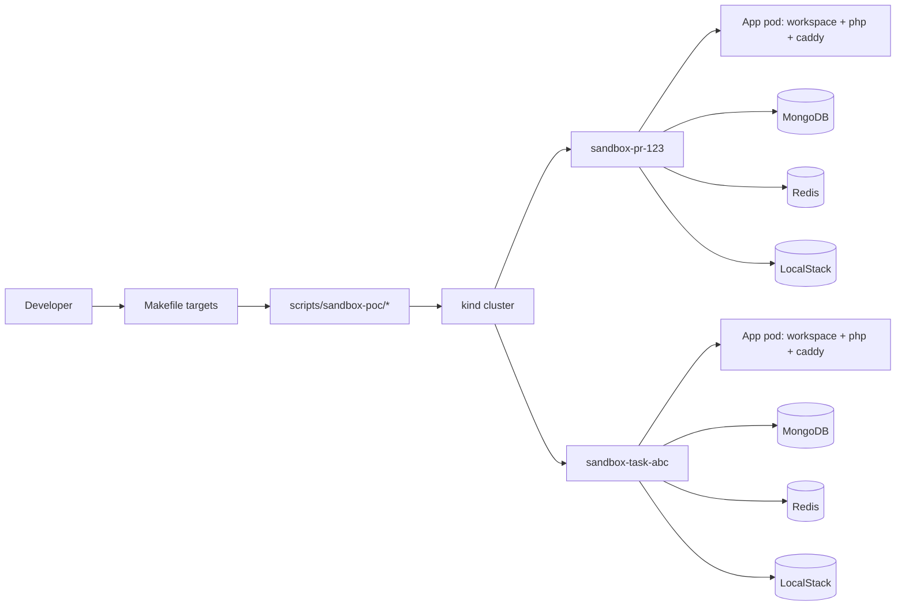

# Local Sandbox POC

This POC proves the target sandbox model locally on `kind`:

- one namespace per task or PR
- one isolated app runtime per namespace
- one MongoDB instance per namespace
- one Redis instance per namespace
- one deterministic smoke flow that verifies isolation

The default implementation is native Kubernetes because it is the simplest reliable way to prove the lifecycle locally today. The layout maps cleanly to the intended OpenSandbox-based production direction later, and the OpenSandbox installer is kept as an optional experiment, not part of the default path.

## Architecture



Each sandbox namespace gets its own release of the same chart, so the app stack and stateful dependencies are isolated by namespace and by service name.

## Bootstrap

1. Install the local prerequisites:
   - Docker
   - `kind`
   - `kubectl`
   - `helm`
2. Start the cluster:
   ```bash
   make sandbox-poc-up
   ```
3. Or let the create command bootstrap everything automatically.

## Create A Sandbox

The create command is idempotent and is the main entry point for agents.

```bash
make sandbox-poc-create SANDBOX_ID=pr-123
```

That command:

- ensures the local cluster exists
- builds and loads the sandbox images
- creates `sandbox-pr-123`
- deploys app, MongoDB, Redis, and LocalStack
- syncs the repo into the workspace container
- bootstraps agent credentials and git identity when available

To create a second sandbox in parallel:

```bash
make sandbox-poc-create SANDBOX_ID=task-abc
```

## Smoke Test

Run the deterministic smoke test after the sandboxes are ready:

```bash
make sandbox-poc-smoke SANDBOX_A=pr-123 SANDBOX_B=task-abc
```

The smoke flow verifies:

- the HTTP endpoint responds in both namespaces
- the app workspace has the `codex` CLI available
- customer data written to one sandbox is not visible in the other
- Redis keys set in one sandbox are not visible in the other

You can also smoke a single sandbox:

```bash
make sandbox-poc-smoke SANDBOX_ID=pr-123
```

## Cleanup

Delete a single sandbox namespace:

```bash
make sandbox-poc-delete SANDBOX_ID=pr-123
```

Tear down the local cluster when you are done:

```bash
make sandbox-poc-down
```

## Command Reference

- `make sandbox-poc-up` starts the `kind` cluster.
- `make sandbox-poc-down` deletes the `kind` cluster.
- `make sandbox-poc-install-tools` installs pinned `kind`, `kubectl`, and `helm` into `.sandbox-poc/bin`.
- `make sandbox-poc-build-images` builds and loads the sandbox images.
- `make sandbox-poc-create SANDBOX_ID=...` creates or updates one sandbox namespace.
- `make sandbox-poc-delete SANDBOX_ID=...` deletes one sandbox namespace.
- `make sandbox-poc-smoke SANDBOX_ID=...` or `SANDBOX_A=... SANDBOX_B=...` runs the smoke checks.
- `make sandbox-poc-shell SANDBOX_ID=...` opens a shell inside the workspace container.
- `make sandbox-poc-logs SANDBOX_ID=...` tails sandbox logs.

## Troubleshooting

If a sandbox does not become ready:

```bash
kubectl get pods -n sandbox-pr-123
kubectl get events -n sandbox-pr-123 --sort-by=.lastTimestamp
make sandbox-poc-logs SANDBOX_ID=pr-123
```

If the workspace sync looks stale:

```bash
make sandbox-poc-shell SANDBOX_ID=pr-123
```

Then inspect `/workspace/core-service` inside the container.

If `kind` is missing or the cluster is gone:

```bash
make sandbox-poc-up
```

If you need a full reset:

```bash
make sandbox-poc-delete SANDBOX_ID=pr-123
make sandbox-poc-down
```

## Known Limitations

- The POC runs locally on `kind`, not on Cloudfleet or Hetzner yet.
- Storage is intentionally simple and ephemeral for the POC. Cleanup removes the namespace and its resources.
- The current flow uses native Kubernetes resources by default. OpenSandbox is available only as an optional experiment for later comparison.
- The images are built for `linux/amd64` to keep the POC deterministic.

## Next Steps

When this moves to managed Kubernetes, the main changes should be:

- swap `kind` for a managed cluster on Cloudfleet + Hetzner
- replace local `emptyDir` storage with the right persistent volumes and storage classes
- add ingress, TLS, and registry integration
- move sandbox creation into a controller or operator flow, keeping the namespace-per-sandbox model
- keep the same create / smoke / delete ergonomics so the developer workflow does not change
