# Architecture: Abstract Async Endpoint Cache Refresh

## Current Architecture Fit

Issue #176 should introduce a reusable cache-refresh foundation, not a Customer-only worker design. Customer is the first adopter because it already has cached repository reads and cache invalidation paths, but the invalidation listener, refresh command, queue, worker, metrics, and abstract orchestration must be reusable by future bounded contexts.

Automatic CRUD invalidation should be handled close to persistence through a shared Doctrine MongoDB ODM listener. Domain events remain useful for cross-context reactions and async refresh scheduling, but the current Customer events do not carry complete cacheable entity snapshots. They can safely identify affected cache entries; they should not be the only source for rebuilding cached values unless future events add complete, versioned, serialization-stable payloads.

The current repository already has the right primitives:

- Any domain event can flow through `Shared/Infrastructure/Bus/Event/Async/DomainEventEnvelope`.
- `Shared/Infrastructure/Bus/Event/Async/DomainEventMessageHandler` already reads domain events from the async event transport and invokes tagged subscribers.
- CQRS command objects and handlers already live in `Application/Command` and `Application/CommandHandler`.
- `Shared/Application/Command` already exists, and deptrac collects `Application/Command` and `Application/CommandHandler`.
- Shared metrics already live in `Shared/Application/Observability/Metric`.
- Shared cache utilities already live in `Shared/Infrastructure/Cache`.
- Context-specific cache behavior already appears as repository decorators, collections, resolvers, factories, and event subscribers.
- Repository writes commonly flow through `BaseRepository::save()` and `BaseRepository::delete()`, while some infrastructure repositories use custom delete methods. An ODM flush listener can cover these persistence paths more consistently than per-entity cache repositories.
- ODM change sets can expose old and new indexed values, such as previous and current Customer email, which are needed for correct tag invalidation.

The implementation should add shared abstractions and thin context adapters. It should not add Customer-only queue contracts that future domains would need to copy.

## Directory Rules

This plan follows the repository rule: one directory contains one class type.

- Put the reusable refresh command in `src/Shared/Application/Command`.
- Put reusable refresh command handlers and abstract handler bases in `src/Shared/Application/CommandHandler`.
- Put reusable DTOs, resolver interfaces, event-subscriber bases, factories, and metrics in their matching class-type directories.
- Put reusable metrics under `src/Shared/Application/Observability/Metric`, matching the existing shared observability structure.
- Put reusable infrastructure collaborators in existing or deptrac-collected class-type directories such as `src/Shared/Infrastructure/{Cache,Collection,EventListener,Resolver}`.
- Put bounded-context adapters in existing context directories such as `src/Core/Customer/Application/{CommandHandler,EventSubscriber,Factory}` and `src/Core/Customer/Infrastructure/{Collection,Repository,Resolver}`.
- Do not introduce new context directories named `Cache`, `ReadModel`, `Policy`, `Registry`, `Scheduler`, `Message`, or `MessageHandler`.
- Do not create a Customer `Infrastructure/Cache` directory. Cache refresh is part of the existing repository, collection, resolver, subscriber, factory, command, and handler surface.
- Do not add cache invalidation methods to Domain repository interfaces. Cache invalidation is an infrastructure/application concern and must not leak into Domain contracts.
- Put automatic CRUD invalidation mapping in resolver and collection classes keyed by document class, operation, and changed fields.

## Architecture Diagram

```mermaid
flowchart LR
    subgraph Domain["Any bounded-context Domain layer"]
        DomainEvent["DomainEvent\nCustomerCreatedEvent\nFutureContextEvent"]
    end

    subgraph WriteSide["Any bounded-context write side"]
        WriteApi["Write API\ncommand handlers"]
        OdmFlush["Doctrine MongoDB ODM flush"]
    end

    subgraph DomainEventWorker["Shared async domain-event path"]
        EventEnvelope["DomainEventEnvelope"]
        EventQueue["domain-events SQS transport\nLocalStack locally"]
        EventWorker["DomainEventMessageHandler\nreads any domain event"]
    end

    subgraph SharedInvalidation["Shared automatic CRUD invalidation"]
        InvalidationListener["CacheInvalidationDoctrineEventListener"]
        RuleCollection["CacheInvalidationRuleCollection"]
        TagResolver["CacheInvalidationTagResolver"]
        TagSetDto["CacheInvalidationTagSet DTO"]
    end

    subgraph SharedRefresh["Shared cache-refresh foundation"]
        AbstractSubscriber["AbstractCacheInvalidationSubscriber"]
        AbstractFactory["AbstractCacheRefreshCommandFactory"]
        RefreshCommand["CacheRefreshCommand\nrepository_refresh | event_snapshot | invalidate_only"]
        RefreshWorker["CacheRefreshCommandHandler\nsingle shared worker"]
        AbstractHandler["AbstractCacheRefreshCommandHandler"]
        PolicyDto["CacheRefreshPolicy DTO"]
        TargetDto["CacheRefreshTarget DTO"]
        ResultDto["CacheRefreshResult DTO"]
        HandlerResolver["CacheRefreshCommandHandlerResolver"]
        PolicyResolver["CacheRefreshPolicyResolver"]
        TargetResolver["CacheRefreshTargetResolverCollection"]
        KeyBuilder["CacheKeyBuilder"]
        Metrics["Shared cache-refresh metrics"]
    end

    subgraph CustomerAdapter["Customer first adopter"]
        CustomerSubscriber["Customer cache invalidation subscribers"]
        CustomerFactory["CustomerCacheRefreshCommandFactory"]
        CustomerHandler["CustomerCacheRefreshCommandHandler\nregistered adapter"]
        CustomerTargetResolver["CustomerCacheRefreshTargetResolver"]
        CustomerInvalidationRules["CustomerCacheInvalidationRuleCollection"]
        CustomerInvalidationResolver["CustomerCacheInvalidationTagResolver"]
        CustomerPolicyCollection["CustomerCachePolicyCollection"]
        CachedCustomerRepository["CachedCustomerRepository"]
        CustomerRepository["MongoCustomerRepository"]
    end

    subgraph FutureAdapter["Future bounded-context adopter"]
        FutureSubscriber["Future context subscriber"]
        FutureFactory["Future context command factory"]
        FutureHandler["Future context refresh handler"]
        FutureRepository["Future cached repository"]
    end

    subgraph RefreshTransport["Shared cache-refresh queue"]
        RefreshQueue["cache-refresh SQS transport\nLocalStack locally"]
        FailedQueue["failed-cache-refresh transport"]
        MessengerWorkers["Symfony Messenger workers"]
    end

    subgraph Runtime["Cache runtime"]
        CachePools["Redis tag-aware cache pools\ncontext + family scoped"]
    end

    subgraph Observability["Shared observability"]
        Emitter["BusinessMetricsEmitterInterface"]
    end

    WriteApi --> DomainEvent
    WriteApi --> OdmFlush
    OdmFlush --> InvalidationListener
    InvalidationListener --> RuleCollection
    RuleCollection --> CustomerInvalidationRules
    CustomerInvalidationRules --> CustomerInvalidationResolver
    InvalidationListener --> TagResolver
    CustomerInvalidationResolver --> TagResolver
    TagResolver --> TagSetDto
    TagSetDto --> CachePools
    InvalidationListener --> RefreshCommand
    InvalidationListener --> Metrics

    DomainEvent --> EventEnvelope
    EventEnvelope --> EventQueue
    EventQueue --> EventWorker

    EventWorker --> CustomerSubscriber
    EventWorker --> FutureSubscriber

    CustomerSubscriber --> AbstractSubscriber
    FutureSubscriber --> AbstractSubscriber
    AbstractSubscriber --> CachePools
    AbstractSubscriber --> TargetResolver
    CustomerTargetResolver --> TargetResolver
    AbstractSubscriber --> AbstractFactory
    CustomerFactory --> AbstractFactory
    FutureFactory --> AbstractFactory
    AbstractFactory --> RefreshCommand
    RefreshCommand --> RefreshQueue

    RefreshQueue --> MessengerWorkers
    MessengerWorkers --> RefreshWorker
    RefreshWorker --> HandlerResolver
    HandlerResolver --> CustomerHandler
    HandlerResolver --> FutureHandler
    CustomerHandler --> AbstractHandler
    FutureHandler --> AbstractHandler
    AbstractHandler --> PolicyResolver
    PolicyResolver --> CustomerPolicyCollection
    AbstractHandler --> TargetResolver
    TargetResolver --> TargetDto
    AbstractHandler --> PolicyDto
    AbstractHandler --> KeyBuilder
    CustomerHandler --> CustomerRepository
    CustomerHandler --> CachePools
    AbstractHandler --> ResultDto
    RefreshWorker --> FailedQueue

    ReadApi["Customer read API"] --> CachedCustomerRepository
    CachedCustomerRepository --> PolicyResolver
    CachedCustomerRepository --> KeyBuilder
    CachedCustomerRepository --> CachePools
    CachedCustomerRepository --> CustomerRepository
    FutureReadApi["Future read API"] --> FutureRepository

    AbstractSubscriber --> Metrics
    RefreshWorker --> Metrics
    AbstractHandler --> Metrics
    CachedCustomerRepository --> Metrics
    Metrics --> Emitter
```



## New Source Tree

The implementation PR should add reusable shared classes first, then add Customer as the first adapter. The tree below shows new files and existing files that should be edited.

```text
src/
  Shared/
    Application/
      Command/
        CacheRefreshCommand.php
      CommandHandler/
        AbstractCacheRefreshCommandHandler.php
        CacheRefreshCommandHandler.php
      DTO/
        CacheInvalidationRule.php
        CacheInvalidationTagSet.php
        CacheRefreshPolicy.php
        CacheRefreshResult.php
        CacheRefreshTarget.php
      EventSubscriber/
        AbstractCacheInvalidationSubscriber.php
      Factory/
        AbstractCacheRefreshCommandFactory.php
      Observability/
        Metric/
          CacheHitMetric.php
          CacheMissMetric.php
          CacheRefreshFailedMetric.php
          CacheRefreshScheduledMetric.php
          CacheRefreshStaleServedMetric.php
          CacheRefreshSucceededMetric.php
          ValueObject/
            CacheRefreshMetricDimensions.php
      Resolver/
        CacheRefreshCommandHandlerResolverInterface.php
        CacheRefreshPolicyResolverInterface.php
        CacheRefreshTargetResolverInterface.php
    Infrastructure/
      Cache/
        CacheKeyBuilder.php (existing, edit for generic context/family key helpers)
      Collection/
        CacheInvalidationRuleCollection.php
        CacheRefreshCommandHandlerCollection.php
        CacheRefreshPolicyCollection.php
        CacheRefreshTargetResolverCollection.php
      EventListener/
        CacheInvalidationDoctrineEventListener.php
      Resolver/
        CacheInvalidationTagResolver.php
        CacheRefreshCommandHandlerResolver.php
        CacheRefreshPolicyResolver.php
  Core/
    Customer/
      Application/
        CommandHandler/
          CustomerCacheRefreshCommandHandler.php
        EventSubscriber/
          CustomerCreatedCacheInvalidationSubscriber.php (edit)
          CustomerDeletedCacheInvalidationSubscriber.php (edit)
          CustomerUpdatedCacheInvalidationSubscriber.php (edit)
        Factory/
          CustomerCacheRefreshCommandFactory.php
      Infrastructure/
        Collection/
          CustomerCacheInvalidationRuleCollection.php
          CustomerCachePolicyCollection.php
          CustomerCacheTagCollection.php (existing)
        Repository/
          CachedCustomerRepository.php (edit)
        Resolver/
          CustomerCacheInvalidationTagResolver.php
          CustomerCachePolicyResolver.php
          CustomerCacheRefreshTargetResolver.php
          CustomerCacheTagResolver.php (existing)
```

Planned test tree:

```text
tests/
  Unit/
    Shared/
      Application/
        Command/
          CacheRefreshCommandTest.php
        CommandHandler/
          AbstractCacheRefreshCommandHandlerTest.php
          CacheRefreshCommandHandlerTest.php
        DTO/
          CacheInvalidationRuleTest.php
          CacheInvalidationTagSetTest.php
          CacheRefreshPolicyTest.php
          CacheRefreshResultTest.php
          CacheRefreshTargetTest.php
        EventSubscriber/
          AbstractCacheInvalidationSubscriberTest.php
        Factory/
          AbstractCacheRefreshCommandFactoryTest.php
        Observability/
          Metric/
            CacheRefreshMetricTest.php
            ValueObject/
              CacheRefreshMetricDimensionsTest.php
        Resolver/
          CacheRefreshCommandHandlerResolverInterfaceTest.php
          CacheRefreshPolicyResolverInterfaceTest.php
          CacheRefreshTargetResolverInterfaceTest.php
      Infrastructure/
        Collection/
          CacheInvalidationRuleCollectionTest.php
          CacheRefreshCommandHandlerCollectionTest.php
          CacheRefreshPolicyCollectionTest.php
          CacheRefreshTargetResolverCollectionTest.php
        EventListener/
          CacheInvalidationDoctrineEventListenerTest.php
        Resolver/
          CacheInvalidationTagResolverTest.php
          CacheRefreshCommandHandlerResolverTest.php
          CacheRefreshPolicyResolverTest.php
    Customer/
      Application/
        CommandHandler/
          CustomerCacheRefreshCommandHandlerTest.php
        EventSubscriber/
          CustomerCreatedCacheInvalidationSubscriberTest.php
          CustomerDeletedCacheInvalidationSubscriberTest.php
          CustomerUpdatedCacheInvalidationSubscriberTest.php
        Factory/
          CustomerCacheRefreshCommandFactoryTest.php
      Infrastructure/
        Collection/
          CustomerCacheInvalidationRuleCollectionTest.php
          CustomerCachePolicyCollectionTest.php
        Repository/
          AutomaticCustomerCacheInvalidationTest.php
          CachedCustomerRepositoryPolicyTest.php
        Resolver/
          CustomerCacheInvalidationTagResolverTest.php
          CustomerCachePolicyResolverTest.php
          CustomerCacheRefreshTargetResolverTest.php
  Integration/
    Customer/
      Infrastructure/
        Repository/
          AsyncCustomerCacheRefreshTest.php
```

Configuration and documentation expected to change in the later implementation PR:

```text
config/
  packages/
    cache.yaml
    messenger.yaml
  packages/test/
    cache.yaml
    messenger.yaml (new, only if test routing cannot stay in messenger.yaml)
  services.yaml
.env
.env.test
docs/
  advanced-configuration.md
  design-and-architecture.md
  operational.md
  performance.md
```

## Shared Components

### Automatic CRUD Invalidation

`CacheInvalidationDoctrineEventListener` should be the generic write-side invalidation point for CRUD operations. It belongs in `Shared/Infrastructure/EventListener` because it depends on Doctrine MongoDB ODM flush lifecycle details.

The listener should:

1. Inspect scheduled insertions, updates, and deletions during flush.
2. Read document class, operation type, identifier, and change-set values.
3. Resolve cache tags through a context-provided rule collection and tag resolver.
4. Collect invalidation work during flush and invalidate tags only after a successful flush.
5. Optionally enqueue `CacheRefreshCommand` jobs for policies whose refresh source is `repository_refresh`.
6. Emit invalidation and scheduling metrics without failing completed business writes.

This is preferred over a per-entity cache repository or a Domain repository interface change because it covers `BaseRepository::save()`, `BaseRepository::delete()`, and custom infrastructure delete methods that still flush through ODM. A repository base-class hook can be a fallback only for writes that bypass ODM lifecycle events.

Context-specific mapping remains thin. For Customer, `CustomerCacheInvalidationRuleCollection` and `CustomerCacheInvalidationTagResolver` should map Customer document changes to existing customer ID, email, and collection tags. Update operations must invalidate both previous and current email tags when email changes.

### Generic Refresh Command

`CacheRefreshCommand` is the single queue payload for all bounded contexts. It should carry scalar, serialization-stable data only:

- context name, such as `customer`
- cache family, such as `detail` or `lookup`
- target identifiers as a string map
- triggering domain event name and event ID
- occurred-at timestamp
- refresh strategy
- refresh source, such as `repository_refresh`, `event_snapshot`, or `invalidate_only`
- attempt metadata where Messenger retry handling needs it

The command must not contain Customer-specific fields such as `customerEmail`. Customer-specific meaning belongs in `CustomerCacheRefreshCommandFactory` and `CustomerCacheRefreshTargetResolver`.

The default refresh source for issue #176 is `repository_refresh`: the worker reloads current persisted state through the context adapter and writes the cache entry. `event_snapshot` is a future option only for events that carry a complete, versioned, serialization-stable cache payload and have stale-overwrite guards. Deletes should use `invalidate_only` or tombstone-aware handling rather than warming a removed entity.

### Abstract Subscriber Contract

`AbstractCacheInvalidationSubscriber` should handle domain-event-driven invalidation and refresh scheduling for events that need more than CRUD write detection. It is not the only invalidation path; `CacheInvalidationDoctrineEventListener` owns automatic CRUD invalidation.

The subscriber should handle the common sequence:

1. Resolve affected cache targets from the domain event.
2. Invalidate tags immediately.
3. Create one or more `CacheRefreshCommand` instances.
4. Dispatch refresh commands best-effort.
5. Emit scheduled or failed metrics without breaking domain-event processing.

Concrete subscribers should only map a domain event to context-specific tags and targets. They should not contain cache key construction, queue routing, or worker logic.

### Shared Worker Contract

`CacheRefreshCommandHandler` is the single Messenger worker entrypoint for the `cache-refresh` queue. It should:

1. Resolve a registered context command handler by context and family.
2. Delegate refresh execution to that context handler.
3. Emit common success or failure metrics.
4. Let Messenger route unrecoverable job failures to `failed-cache-refresh` according to configured retry strategy.

`AbstractCacheRefreshCommandHandler` should hold the reusable refresh template for context handlers:

1. Resolve the cache policy.
2. Resolve the concrete target.
3. Build cache keys through `CacheKeyBuilder`.
4. Execute the configured refresh source:
   - `repository_refresh`: load current persisted state through a context repository callback and write the cache entry.
   - `event_snapshot`: materialize the cache entry from a complete, versioned event payload when a future event supports it.
   - `invalidate_only`: leave the cache empty after invalidation, typically for deletes or unsupported query families.
5. Return a `CacheRefreshResult`.

Concrete handlers, such as `CustomerCacheRefreshCommandHandler`, should only provide context-specific target loading, such as customer detail by ID or customer lookup by email.

### Policy and Target Resolution

`CacheRefreshPolicy` belongs in `Shared/Application/DTO` because it is data passed across application orchestration. It should contain:

- context
- family
- key namespace
- tags
- soft TTL
- hard TTL
- jitter
- consistency class
- refresh strategy
- refresh source

`CacheRefreshPolicyCollection` belongs in `Shared/Infrastructure/Collection` as the generic iterable policy holder. `CustomerCachePolicyCollection` may compose or configure customer policies in the Customer context, but policy lookup should be performed through the shared resolver interface.

`CacheRefreshTarget` belongs in `Shared/Application/DTO`. It should describe what must be refreshed without depending on Customer classes.

## Queue and Worker Model

Use two worker paths:

- Existing `domain-events` queue: reads any domain event through `DomainEventMessageHandler`.
- New `cache-refresh` queue: reads the generic `CacheRefreshCommand` through `CacheRefreshCommandHandler`.

The implementation should add a single shared cache-refresh transport:

- `CACHE_REFRESH_QUEUE_NAME`
- `FAILED_CACHE_REFRESH_QUEUE_NAME`
- `CACHE_REFRESH_TRANSPORT_DSN`
- `FAILED_CACHE_REFRESH_TRANSPORT_DSN`
- `cache-refresh` transport
- `failed-cache-refresh` transport

Do not create per-domain cache-refresh queues in the first implementation. A single queue keeps worker operations reusable. If future throughput requires separate queues, that should be an operations-driven follow-up with metrics evidence.

## Customer Adapter

Customer should be the first adapter for the shared design:

- Customer CRUD invalidation uses the shared ODM listener plus Customer invalidation rules/resolvers.
- Customer create/update/delete subscribers can remain as domain-event adapters for scheduling or cross-context behavior, but they should not be required for same-aggregate CRUD cache tag invalidation.
- `CustomerCacheRefreshCommandFactory` creates generic `CacheRefreshCommand` instances from Customer events.
- `CustomerCacheRefreshTargetResolver` maps target DTOs to Customer repository lookup inputs.
- `CustomerCacheInvalidationRuleCollection` maps Customer document operations and changed fields to invalidation rules.
- `CustomerCacheInvalidationTagResolver` derives concrete ID, email, collection, and old-email tags from ODM change-set data.
- `CustomerCachePolicyCollection` declares Customer detail, lookup, collection, reference, and negative lookup policies.
- `CustomerCacheRefreshCommandHandler` extends or composes `AbstractCacheRefreshCommandHandler` and registers for `customer` context families.
- `CachedCustomerRepository` consumes the shared policy resolver and key builder instead of method-local TTL literals.

The first implementation should refresh currently cached same-entity families:

- Customer detail by ID.
- Customer lookup by email.

Collection and reference policies should be declared and immediately invalidated by tags, but arbitrary proactive collection materialization stays out of scope until the codebase has a stable query-shape abstraction.

The first Customer implementation should use `repository_refresh` for detail and email lookup. Current Customer domain events carry IDs and emails, not the complete Customer cache payload, so event-only refresh would risk writing incomplete or stale values.

## Observability

Metric classes should be shared because refresh lifecycle is not Customer-specific:

- `CacheRefreshScheduledMetric`
- `CacheRefreshSucceededMetric`
- `CacheRefreshFailedMetric`
- `CacheHitMetric`
- `CacheMissMetric`
- `CacheRefreshStaleServedMetric`

Place them under `Shared/Application/Observability/Metric`. Use dimensions such as context, family, source event, result, and failure type. Context-specific metrics should only be added when a bounded context needs dimensions that the shared classes cannot represent.

## Failure Semantics

- Cache failures fall back to the inner repository where the current repository already does so.
- ODM listener collection happens during flush, but cache invalidation runs only after a successful flush so failed writes do not evict good cache entries.
- ODM listener invalidation or scheduling failures are logged and measured after the write succeeds; they do not roll back a completed business write.
- Subscriber dispatch failures are logged and measured but do not break domain-event handling.
- Worker refresh failures are logged and measured; retry and failed routing are controlled by Messenger.
- Delete events invalidate and avoid warming deleted entities.
- Domain remains free of Symfony, cache, Messenger, logging, and metrics dependencies.

## Implementation Sequence

1. Add shared DTOs, resolver interfaces, collections, abstract subscriber, abstract factory, generic refresh command, generic worker, abstract context handler, ODM invalidation listener, and shared metrics.
2. Add generic invalidation rule/tag resolution and Customer invalidation rules for CRUD create/update/delete change sets.
3. Add the single `cache-refresh` and `failed-cache-refresh` Messenger transports.
4. Add Customer adapter classes that extend or compose the shared abstractions.
5. Update `CachedCustomerRepository` to use resolved policies and generic key helpers.
6. Update Customer subscribers only for domain-event scheduling needs that are not already handled by automatic CRUD invalidation.
7. Add unit and integration tests for shared orchestration, automatic CRUD invalidation, and the Customer adapter.
8. Update docs and run cache performance evidence where runtime services allow.

## Architectural Tradeoffs

- This design keeps reusable orchestration in `Shared` and leaves domain-specific mapping in bounded contexts.
- It uses the existing CQRS command/handler names instead of inventing `Request`, `Message`, `MessageHandler`, `Scheduler`, or `Worker` directories.
- It uses `Policy` as a DTO class name, not as a new directory type.
- It avoids `ReadModel` because the current project read paths are repository and resolver based, and issue #176 is about refreshing endpoint cache entries rather than introducing a separate projection model.
- It chooses an ODM flush listener for automatic CRUD invalidation because it can observe all flushed document changes and old/new values. An abstract repository invalidation base is narrower and can miss custom infrastructure methods or direct `DocumentManager` writes.
- It keeps repository interfaces cache-free. Cache invalidation mapping is expressed through infrastructure resolver and collection classes, not Domain contracts.
