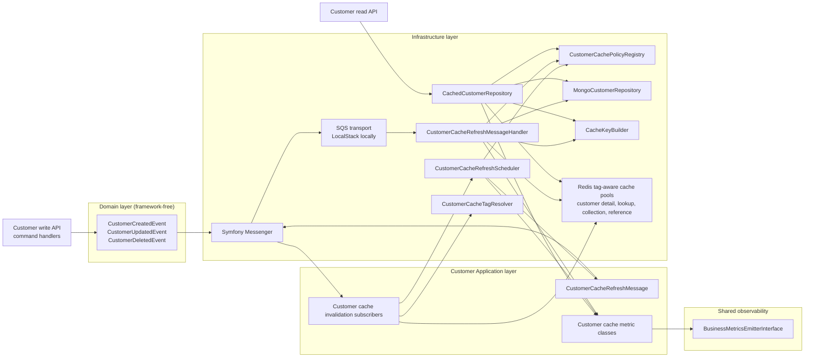

# Architecture: Async Endpoint Cache Refresh

## Current Architecture Fit

The implementation should extend the existing hexagonal/CQRS setup:

- Domain events stay in `src/Core/Customer/Domain/Event`.
- Event subscribers stay in `src/Core/Customer/Application/EventSubscriber`.
- Cache policy, scheduling, and refresh handling belong in `Infrastructure/Cache` because they coordinate Symfony Cache, Messenger, and Redis/SQS concerns.
- Application subscribers can call Infrastructure cache services under the current deptrac rules, but new classes must still use directories captured by `deptrac.yaml`.
- Cache repository decorator remains in `Infrastructure/Repository`.
- Messenger transport and handler wiring stay in Symfony configuration.

## Architecture Diagram



Read requests continue to use the cache repository decorator. Write-side domain events invalidate affected tags and schedule same-entity refresh messages. Refresh workers warm customer detail and email lookup cache entries through the inner repository without blocking business writes.

## Planned Source Tree

The implementation PR should add the following source files. Existing files that need edits are listed separately below.

```text
src/
  Core/
    Customer/
      Application/
        Message/
          CustomerCacheRefreshMessage.php
        Metric/
          CustomerCacheHitMetric.php
          CustomerCacheMetricDimensions.php
          CustomerCacheMissMetric.php
          CustomerCacheRefreshFailedMetric.php
          CustomerCacheRefreshScheduledMetric.php
          CustomerCacheRefreshSucceededMetric.php
          CustomerCacheStaleServedMetric.php
      Infrastructure/
        Cache/
          CustomerCacheConsistency.php
          CustomerCacheFamily.php
          CustomerCachePolicy.php
          CustomerCachePolicyCollection.php
          CustomerCachePolicyRegistry.php
          CustomerCachePolicyRegistryInterface.php
          CustomerCacheRefreshMessageHandler.php
          CustomerCacheRefreshScheduler.php
          CustomerCacheRefreshSchedulerInterface.php
          CustomerCacheRefreshStrategy.php
```

This layout matches the existing `deptrac.yaml` collectors:

- `Application/Message` and `Application/Metric` are collected as Application.
- `Infrastructure/Cache` is collected as Infrastructure.
- `Application/Cache`, `Application/Scheduler`, and `Application/MessageHandler` are intentionally avoided because they are not collected by the current deptrac configuration.

Planned test files:

```text
tests/
  Unit/
    Customer/
      Application/
        EventSubscriber/
          CustomerCreatedCacheInvalidationSubscriberTest.php
          CustomerDeletedCacheInvalidationSubscriberTest.php
          CustomerUpdatedCacheInvalidationSubscriberTest.php
        Message/
          CustomerCacheRefreshMessageTest.php
        Metric/
          CustomerCacheMetricTest.php
      Infrastructure/
        Cache/
          CustomerCachePolicyRegistryTest.php
          CustomerCachePolicyTest.php
          CustomerCacheRefreshMessageHandlerTest.php
          CustomerCacheRefreshSchedulerTest.php
        Repository/
          CachedCustomerRepositoryPolicyTest.php
  Integration/
    Customer/
      Infrastructure/
        Cache/
          AsyncCustomerCacheRefreshTest.php
```

Configuration and existing files expected to change:

```text
config/
  packages/
    cache.yaml
    messenger.yaml
  packages/test/
    cache.yaml
    messenger.yaml (new, only if test routing cannot stay in messenger.yaml)
  services.yaml
.env
.env.test
src/
  Core/
    Customer/
      Application/
        EventSubscriber/
          CustomerCreatedCacheInvalidationSubscriber.php
          CustomerDeletedCacheInvalidationSubscriber.php
          CustomerUpdatedCacheInvalidationSubscriber.php
      Infrastructure/
        Repository/
          CachedCustomerRepository.php
docs/
  advanced-configuration.md
  design-and-architecture.md
  operational.md
  performance.md
```

## Proposed Components

### Cache Policy Model

Add typed policy classes in `src/Core/Customer/Infrastructure/Cache`:

- `CustomerCacheFamily`
- `CustomerCacheConsistency`
- `CustomerCacheRefreshStrategy`
- `CustomerCachePolicy`
- `CustomerCachePolicyRegistry`
- `CustomerCachePolicyRegistryInterface`
- optional typed collection for registry construction

Use services.yaml arguments for TTLs/jitter so defaults are configurable without editing repository code.

### Cache Refresh Message Path

Add a dedicated message model:

- `CustomerCacheRefreshMessage` in `src/Core/Customer/Application/Message`
- `CustomerCacheRefreshMessageHandler` in `src/Core/Customer/Infrastructure/Cache`
- `CustomerCacheRefreshScheduler` in `src/Core/Customer/Infrastructure/Cache`

The message should carry scalar payload only, such as family name, customer ID, email, and event metadata, so it remains stable across Messenger serialization. The scheduler dispatches messages through `MessageBusInterface` and catches dispatch failures. The handler warms same-entity entries from the underlying persisted state, such as customer detail by ID and lookup by email. For delete events, it should avoid warming deleted entities and may schedule only collection/reference policy refresh markers where safe.

### Repository Decorator Changes

Update `CachedCustomerRepository` to inject:

- detail cache pool
- lookup cache pool
- policy registry
- metrics emitter or cache metrics service

Use the policy registry for TTL, tags, and cache key metadata. Preserve existing `findFresh()` bypass behavior for write paths.

### Messenger Configuration

Add:

- `CACHE_REFRESH_QUEUE_NAME`
- `FAILED_CACHE_REFRESH_QUEUE_NAME`
- `CACHE_REFRESH_TRANSPORT_DSN`
- `FAILED_CACHE_REFRESH_TRANSPORT_DSN`
- `cache-refresh` transport
- `failed-cache-refresh` transport
- routing for `CustomerCacheRefreshMessage`

In `when@test`, route cache refresh to in-memory transport.

### Observability

Add typed metrics under `src/Core/Customer/Application/Metric` or shared observability if reusable:

- `CustomerCacheRefreshScheduledMetric`
- `CustomerCacheRefreshSucceededMetric`
- `CustomerCacheRefreshFailedMetric`
- `CustomerCacheHitMetric`
- `CustomerCacheMissMetric`
- `CustomerCacheStaleServedMetric`

Prefer a `CustomerCacheMetricDimensions` value object with `Endpoint=CustomerCache`, `Operation=<operation>`, `Family=<family>`.

### Failure Semantics

- Repository cache failures fall back to the inner repository.
- Scheduler failures log and emit a failure metric, then return.
- Handler failures log and emit a failure metric, then return so poison refresh jobs do not block business behavior.
- Domain event subscribers remain resilient through the existing `DomainEventMessageHandler`.

## Implementation Sequence

1. Add policy model and tests.
2. Split cache pools and update repository TTL usage.
3. Add refresh message/scheduler/handler and Messenger routing.
4. Update subscribers to invalidate plus schedule.
5. Add metrics and tests.
6. Add integration proof and docs.
7. Run CI and cache performance evidence.

## Architectural Tradeoffs

- The first PR should not attempt generic API Platform collection caching. That requires a provider-level design and may be a separate architecture change.
- Reference-data policies can be declared before reference-data domain events exist. Full refresh triggering for type/status mutations should be follow-up work unless events are added in this PR.
