# Architecture: Abstract Async Endpoint Cache Refresh

## Current Architecture Fit

Issue #176 should introduce a reusable cache-refresh foundation, not a Customer-only worker design. Customer is the first adopter because it already has cached repository reads and cache invalidation paths, but the invalidation listener, refresh command, queue, worker, metrics, and abstract orchestration must be reusable by future bounded contexts.

Automatic cache invalidation should be layered so the system clears cache whenever a reliable signal exists. Managed document changes are handled close to persistence through a shared Doctrine MongoDB ODM listener. Exposed domain events also invalidate and can schedule refresh work through shared subscribers. Custom repository methods that bypass ODM change sets must call the same shared invalidation command after a successful write. Current Customer events do not carry complete cacheable entity snapshots, so they can identify affected cache entries but should not be the only source for rebuilding cached values unless future events add complete, versioned, serialization-stable payloads.

The current repository already has the right primitives:

- Any domain event can flow through `Shared/Infrastructure/Bus/Event/Async/DomainEventEnvelope`.
- `Shared/Infrastructure/Bus/Event/Async/DomainEventMessageHandler` already reads domain events from the async event transport and invokes tagged subscribers.
- Symfony Messenger SQS transports require `symfony/amazon-sqs-messenger`; LocalStack DSNs must use the queue-name path form, such as `sqs://localstack:4566/cache-refresh?sslmode=disable&region=us-east-1&access_key=fake&secret_key=fake`, so queues can be auto-created without AWS metadata lookup.
- CQRS command objects and handlers already live in `Application/Command` and `Application/CommandHandler`.
- `Shared/Application/Command` already exists, and deptrac collects `Application/Command` and `Application/CommandHandler`.
- Shared metrics already live in `Shared/Application/Observability/Metric`.
- Shared cache utilities already live in `Shared/Infrastructure/Cache`.
- Context-specific cache behavior already appears as repository decorators, collections, resolvers, factories, and event subscribers.
- Repository writes commonly flow through `BaseRepository::save()` and `BaseRepository::delete()`, while some infrastructure repositories use custom delete methods such as `deleteByEmail`, `deleteById`, and `deleteByValue`. The current custom methods still remove managed documents and flush through ODM, so the ODM listener should cover them.
- ODM change sets can expose old and new indexed values, such as previous and current Customer email, which are needed for correct tag invalidation.
- Domain event subscribers already give a second automatic invalidation signal when business code exposes events.
- Future bulk writes or direct database operations may bypass ODM UnitOfWork change sets. Those custom repository methods need an explicit repository-level fallback that calls the shared invalidation command with the affected context, family, and identifiers after the write succeeds.

The implementation should add shared abstractions and thin context adapters. It should not add Customer-only queue contracts that future domains would need to copy.

## Directory Rules

This plan follows the repository rule: one directory contains one class type.

- Put the reusable refresh command in `src/Shared/Application/Command`.
- Put reusable refresh command handlers and abstract handler bases in `src/Shared/Application/CommandHandler`.
- Put reusable DTOs, resolver interfaces, event-subscriber bases, factories, and metrics in their matching class-type directories.
- Put reusable metrics under `src/Shared/Application/Observability/Metric`, matching the existing shared observability structure.
- Put reusable infrastructure collaborators in existing or deptrac-collected class-type directories such as `src/Shared/Infrastructure/{Cache,Collection,EventListener,Resolver}`.
- Put bounded-context adapters in existing context directories such as `src/Core/Customer/Application/{CommandHandler,EventSubscriber,Factory}` and `src/Core/Customer/Infrastructure/{Collection,Repository,Resolver}`.
- Do not introduce new context directories named `Cache`, `ReadModel`, `Policy`, `Registry`, `Scheduler`, `Message`, or `MessageHandler`.
- Do not create a Customer `Infrastructure/Cache` directory. Cache refresh is part of the existing repository, collection, resolver, subscriber, factory, command, and handler surface.
- Do not add cache invalidation methods to Domain repository interfaces. Cache invalidation is an infrastructure/application concern and must not leak into Domain contracts.
- Put automatic CRUD invalidation mapping in resolver and collection classes keyed by document class, operation, and changed fields.
- Put repository-level fallback calls inside existing `Infrastructure/Repository` classes only for custom write methods that cannot be observed by ODM lifecycle events. They should reuse the shared invalidation command/resolver surface and stay best effort.

## Architecture Diagram

```mermaid
flowchart LR
    subgraph Domain["Any bounded-context Domain layer"]
        DomainEvent["DomainEvent\nCustomerCreatedEvent\nFutureContextEvent"]
    end

    subgraph WriteSide["Any bounded-context write side"]
        WriteApi["Write API\ncommand handlers"]
        OdmFlush["Doctrine MongoDB ODM flush"]
    end

    subgraph DomainEventWorker["Shared async domain-event path"]
        EventEnvelope["DomainEventEnvelope"]
        EventQueue["domain-events SQS transport\nLocalStack locally"]
        EventWorker["DomainEventMessageHandler\nreads any domain event"]
    end

    subgraph SharedInvalidation["Shared layered invalidation"]
        InvalidationCommand["CacheInvalidationCommand\nidempotent tag clear request"]
        InvalidationHandler["CacheInvalidationCommandHandler"]
        InvalidationListener["CacheInvalidationDoctrineEventListener"]
        RuleCollection["CacheInvalidationRuleCollection"]
        TagResolver["CacheInvalidationTagResolver"]
        TagSetDto["CacheInvalidationTagSet DTO"]
        CachePoolResolver["CachePoolResolver\ncontext -> tag-aware pool"]
    end

    subgraph SharedRefresh["Shared cache-refresh foundation"]
        AbstractSubscriber["AbstractCacheInvalidationSubscriber"]
        AbstractFactory["AbstractCacheRefreshCommandFactory"]
        RefreshCommand["CacheRefreshCommand\nrepository_refresh | event_snapshot | invalidate_only"]
        RefreshWorker["CacheRefreshCommandHandler\nsingle shared worker"]
        AbstractHandler["CacheRefreshCommandHandlerBase"]
        PolicyDto["CacheRefreshPolicy DTO"]
        TargetDto["CacheRefreshTarget DTO"]
        ResultDto["CacheRefreshResult DTO"]
        HandlerResolver["CacheRefreshCommandHandlerResolver"]
        PolicyResolver["CacheRefreshPolicyResolverInterface"]
        TargetResolver["CacheRefreshTargetResolverCollection"]
        KeyBuilder["CacheKeyBuilder"]
        Metrics["Shared cache-refresh metrics"]
    end

    subgraph CustomerAdapter["Customer first adopter"]
        CustomerSubscriber["Customer cache invalidation subscribers"]
        CustomerFactory["CustomerCacheRefreshCommandFactory"]
        CustomerHandler["CustomerCacheRefreshCommandHandler\nregistered adapter"]
        CustomerTargetResolver["CustomerCacheRefreshTargetResolver"]
        CustomerInvalidationRules["CustomerCacheInvalidationRuleCollection"]
        CustomerInvalidationResolver["CustomerCacheInvalidationTagResolver"]
        CustomerPolicyCollection["CustomerCachePolicyCollection"]
        CustomerPolicyResolver["CustomerCachePolicyResolver"]
        CachedCustomerRepository["CachedCustomerRepository"]
        CustomerRepository["MongoCustomerRepository"]
        CustomRepoFallback["Custom repository fallback\nonly when ODM cannot observe"]
    end

    subgraph FutureAdapter["Future bounded-context adopter"]
        FutureSubscriber["Future context subscriber"]
        FutureFactory["Future context command factory"]
        FutureHandler["Future context refresh handler"]
        FutureRepository["Future cached repository"]
    end

    subgraph RefreshTransport["Shared cache-refresh queue"]
        RefreshQueue["cache-refresh SQS transport\nLocalStack locally"]
        FailedQueue["failed-cache-refresh transport"]
        MessengerWorkers["Symfony Messenger workers"]
    end

    subgraph Runtime["Cache runtime"]
        CachePools["Redis tag-aware cache pools\ncontext + family scoped"]
    end

    subgraph Observability["Shared observability"]
        Emitter["BusinessMetricsEmitterInterface"]
    end

    WriteApi --> DomainEvent
    WriteApi --> OdmFlush
    OdmFlush --> InvalidationListener
    CustomerRepository --> CustomRepoFallback
    CustomRepoFallback --> InvalidationCommand
    InvalidationListener --> InvalidationCommand
    InvalidationCommand --> InvalidationHandler
    InvalidationHandler --> RuleCollection
    RuleCollection --> CustomerInvalidationRules
    CustomerInvalidationRules --> CustomerInvalidationResolver
    InvalidationHandler --> TagResolver
    CustomerInvalidationResolver --> TagResolver
    TagResolver --> TagSetDto
    TagSetDto --> CachePools
    InvalidationHandler --> RefreshCommand
    InvalidationHandler --> Metrics

    DomainEvent --> EventEnvelope
    EventEnvelope --> EventQueue
    EventQueue --> EventWorker

    EventWorker --> CustomerSubscriber
    EventWorker --> FutureSubscriber

    CustomerSubscriber --> AbstractSubscriber
    FutureSubscriber --> AbstractSubscriber
    AbstractSubscriber --> InvalidationCommand
    AbstractSubscriber --> TargetResolver
    CustomerTargetResolver --> TargetResolver
    AbstractSubscriber --> AbstractFactory
    CustomerFactory --> AbstractFactory
    FutureFactory --> AbstractFactory
    AbstractFactory --> RefreshCommand
    RefreshCommand --> RefreshQueue

    RefreshQueue --> MessengerWorkers
    MessengerWorkers --> RefreshWorker
    RefreshWorker --> HandlerResolver
    HandlerResolver --> CustomerHandler
    HandlerResolver --> FutureHandler
    CustomerHandler --> AbstractHandler
    FutureHandler --> AbstractHandler
    AbstractHandler --> PolicyResolver
    PolicyResolver --> CustomerPolicyResolver
    CustomerPolicyResolver --> CustomerPolicyCollection
    AbstractHandler --> TargetResolver
    TargetResolver --> TargetDto
    AbstractHandler --> PolicyDto
    AbstractHandler --> KeyBuilder
    CustomerHandler --> CustomerRepository
    CustomerHandler --> CustomerPolicyCollection
    CustomerHandler --> CachePools
    AbstractHandler --> ResultDto
    RefreshWorker --> FailedQueue

    ReadApi["Customer read API"] --> CachedCustomerRepository
    CachedCustomerRepository --> CustomerPolicyCollection
    CachedCustomerRepository --> KeyBuilder
    CachedCustomerRepository --> CachePools
    CachedCustomerRepository --> CustomerRepository
    FutureReadApi["Future read API"] --> FutureRepository

    AbstractSubscriber --> Metrics
    RefreshWorker --> Metrics
    AbstractHandler --> Metrics
    CachedCustomerRepository --> Metrics
    Metrics --> Emitter
```



## New Source Tree

The implementation PR should add reusable shared classes first, then add Customer as the first adapter. The tree below shows new files and existing files that should be edited.

```text
src/
  Shared/
    Application/
      Command/
        CacheInvalidationCommand.php
        CacheRefreshCommand.php
      CommandHandler/
        CacheInvalidationCommandHandler.php
        CacheRefreshCommandHandlerBase.php
        CacheRefreshCommandHandler.php
      Exception/
        UnsupportedCacheRefreshPolicyException.php
      DTO/
        CacheChangeSet.php
        CacheFieldChange.php
        CacheInvalidationRule.php
        CacheInvalidationTagSet.php
        CacheRefreshPolicy.php
        CacheRefreshResult.php
        CacheRefreshTarget.php
      EventSubscriber/
        AbstractCacheInvalidationSubscriber.php
      Factory/
        AbstractCacheRefreshCommandFactory.php
      Observability/
        Metric/
          CacheHitMetric.php
          CacheMissMetric.php
          CacheRefreshFailedMetric.php
          CacheRefreshScheduledMetric.php
          CacheRefreshStaleServedMetric.php
          CacheRefreshSucceededMetric.php
          ValueObject/
            CacheRefreshMetricDimensions.php
      Resolver/
        CachePoolResolverInterface.php
        CacheRefreshCommandHandlerResolverInterface.php
        CacheRefreshPolicyResolverInterface.php
        CacheRefreshTargetResolverInterface.php
        DocumentCacheInvalidationResolverInterface.php
    Infrastructure/
      Cache/
        CacheKeyBuilder.php (existing, edit for generic context/family key helpers)
      Collection/
        CacheInvalidationRuleCollection.php
        CacheRefreshCommandCollection.php
        CacheRefreshCommandHandlerCollection.php
        CacheRefreshPolicyCollection.php
        CacheRefreshTargetResolverCollection.php
      EventListener/
        CacheInvalidationDoctrineEventListener.php
      Resolver/
        CachePoolResolver.php
        CacheInvalidationTagResolver.php
        CacheRefreshCommandHandlerResolver.php
        CacheRefreshPolicyResolver.php
  Core/
    Customer/
      Application/
        CommandHandler/
          CustomerCacheRefreshCommandHandler.php
        EventSubscriber/
          CustomerCreatedCacheInvalidationSubscriber.php (edit)
          CustomerDeletedCacheInvalidationSubscriber.php (edit)
          CustomerUpdatedCacheInvalidationSubscriber.php (edit)
        Factory/
          CustomerCacheRefreshCommandFactory.php
      Infrastructure/
        Collection/
          CustomerCacheInvalidationRuleCollection.php
          CustomerCachePolicyCollection.php
          CustomerCacheTagCollection.php (existing)
        Repository/
          CachedCustomerRepository.php (edit)
          MongoCustomerRepository.php (review custom write methods for ODM visibility)
          MongoStatusRepository.php (review custom write methods for ODM visibility)
          MongoTypeRepository.php (review custom write methods for ODM visibility)
        Resolver/
          CustomerCachePolicyResolver.php
          CustomerCacheInvalidationTagResolver.php
          CustomerCacheRefreshTargetResolver.php
          CustomerCacheTagResolver.php (existing)
```

Planned test tree:

```text
tests/
  Unit/
    Shared/
      Application/
        Command/
          CacheInvalidationCommandTest.php
          CacheRefreshCommandTest.php
        CommandHandler/
          CacheInvalidationCommandHandlerTest.php
          CacheRefreshCommandHandlerTest.php
        DTO/
          CacheChangeSetTest.php
          CacheInvalidationRuleTest.php
          CacheInvalidationTagSetTest.php
          CacheRefreshPolicyTest.php
          CacheRefreshResultTest.php
        EventSubscriber/
          AbstractCacheInvalidationSubscriberTest.php
        Observability/
          Metric/
            CacheRefreshMetricTest.php
      Infrastructure/
        Cache/
          CacheKeyBuilderTest.php
        Collection/
          CacheRefreshCollectionTest.php
        EventListener/
          CacheInvalidationDoctrineEventListenerTest.php
        Resolver/
          CachePoolResolverTest.php
          CacheInvalidationTagResolverTest.php
          CacheRefreshCommandHandlerTest.php (covers handler resolver integration)
          CacheRefreshPolicyResolverTest.php
    Customer/
      Application/
        CommandHandler/
          CustomerCacheRefreshCommandHandlerTest.php
        EventSubscriber/
          CustomerCreatedCacheInvalidationSubscriberTest.php
          CustomerDeletedCacheInvalidationSubscriberTest.php
          CustomerUpdatedCacheInvalidationSubscriberTest.php
        Factory/
          CustomerCacheRefreshCommandFactoryTest.php
      Infrastructure/
        Collection/
          CustomerCacheInvalidationRuleCollectionTest.php
          CustomerCachePolicyCollectionTest.php
        Repository/
          CachedCustomerRepositoryTest.php
        Resolver/
          CustomerCachePolicyResolverTest.php
          CustomerCacheInvalidationTagResolverTest.php
          CustomerCacheRefreshTargetResolverTest.php
  Integration/
    CustomerHttpCacheTest.php
    Customer/
      Infrastructure/
        Repository/
          MongoCustomerRepositoryInvalidationTest.php
          MongoCustomerRepositoryTagInvalidationTest.php
```

Configuration and documentation expected to change in the later implementation PR:

```text
config/
  packages/
    cache.yaml
    messenger.yaml
  packages/test/
    cache.yaml
    messenger.yaml (new, only if test routing cannot stay in messenger.yaml)
  services.yaml
.env
.env.test
docs/
  advanced-configuration.md
  design-and-architecture.md
  operational.md
  performance.md
```

## Shared Components

### Invalidation Coverage Model

All automatic invalidation sources should normalize into one idempotent invalidation path:

1. **Domain event signal**: when a domain event is exposed, `AbstractCacheInvalidationSubscriber` maps the event to a `CacheInvalidationCommand`. This clears affected tags and can schedule refresh work. This path covers business events and cross-context side effects.
2. **ODM entity-change signal**: when Doctrine MongoDB ODM flushes managed document insertions, updates, or deletions, `CacheInvalidationDoctrineEventListener` maps UnitOfWork change sets to the same `CacheInvalidationCommand`. This path covers normal repository writes and custom repository methods that still persist/remove managed documents and flush.
3. **Custom repository fallback signal**: when a custom repository method performs a bulk update/delete, direct query builder write, or external database operation that ODM cannot observe as managed document changes, that repository method must call the shared invalidation command after the write succeeds.

The command/handler path is intentionally idempotent. If a write both changes an ODM document and exposes a domain event, duplicate invalidation of the same tags is acceptable and should not break writes. Refresh scheduling should include a deterministic dedupe key based on context, family, normalized target identifiers, and refresh source so equivalent domain-event and ODM signals collapse to the same refresh target while source IDs remain correlation metadata.

Coverage rules:

- Managed ODM insert/update/delete: automatic through the ODM listener.
- Custom repository methods that load a document, remove or persist it, and flush: automatic through the ODM listener.
- Custom repository methods that bypass UnitOfWork change sets: explicit repository fallback to the shared invalidation command is required.
- Exposed domain events: automatic through domain-event subscribers, independent of whether the ODM listener also observed the write.
- Writes performed outside this service or directly against the database cannot be fully automatic inside this service; they require an integration event, a repository fallback, or an operational cache-clear command.

### Automatic CRUD Invalidation

`CacheInvalidationDoctrineEventListener` should be the generic write-side invalidation point for CRUD operations. It belongs in `Shared/Infrastructure/EventListener` because it depends on Doctrine MongoDB ODM flush lifecycle details.

The listener should:

1. Inspect scheduled insertions, updates, and deletions during flush.
2. Read document class, operation type, identifier, and change-set values.
3. Resolve cache tags through a context-provided rule collection and tag resolver.
4. Collect invalidation work during flush and invalidate tags only after a successful flush.
5. Create a `CacheInvalidationCommand` and let the shared handler clear tags and optionally enqueue `CacheRefreshCommand` jobs for policies whose refresh source is `repository_refresh`.
6. Emit invalidation and scheduling metrics without failing completed business writes.

This is preferred over a per-entity cache repository or a Domain repository interface change because it covers `BaseRepository::save()`, `BaseRepository::delete()`, and custom infrastructure delete methods that still flush through ODM. Repository-level fallback calls are required only for writes that bypass ODM lifecycle events.

Context-specific mapping remains thin. For Customer, `CustomerCacheInvalidationRuleCollection` and `CustomerCacheInvalidationTagResolver` should map Customer document changes to existing customer ID, email, and collection tags. Update operations must invalidate both previous and current email tags when email changes.

### Generic Invalidation Command

`CacheInvalidationCommand` is the synchronous shared invalidation request used by all trigger sources. It should carry scalar, serialization-stable data only:

- context name
- source type, such as `domain_event`, `odm_change_set`, or `repository_fallback`
- document class or event class
- operation, such as `created`, `updated`, `deleted`, `bulk_updated`, or `bulk_deleted`
- target identifiers as a string map
- changed field names and old/new scalar values where available
- source event ID or write operation ID
- deterministic dedupe key

`CacheInvalidationCommandHandler` should:

1. Resolve invalidation rules by context, source type, document or event class, operation, and changed fields.
2. Resolve concrete tags through the context tag resolver.
3. Invalidate tags best-effort after the write or event is known to be successful.
4. Schedule refresh commands only for policies that support proactive refresh.
5. Emit shared invalidation scheduled/succeeded/failed metrics.

The command should be callable directly from the ODM listener, domain event subscribers, and custom repository fallback paths. It should not require a per-entity cache repository.

### Generic Refresh Command

`CacheRefreshCommand` is the single queue payload for all bounded contexts. It should carry scalar, serialization-stable data only:

- context name, such as `customer`
- cache family, such as `detail` or `lookup`
- target identifiers as a string map
- triggering domain event name and event ID
- occurred-at timestamp
- refresh strategy
- refresh source, such as `repository_refresh`, `event_snapshot`, or `invalidate_only`
- deterministic target-based dedupe key
- attempt metadata where Messenger retry handling needs it

The command must not contain Customer-specific fields such as `customerEmail`. Customer-specific meaning belongs in `CustomerCacheRefreshCommandFactory` and `CustomerCacheRefreshTargetResolver`.

The default refresh source for issue #176 is `repository_refresh`: the worker reloads current persisted state through the context adapter and writes the cache entry. `event_snapshot` is a future option only for events that carry a complete, versioned, serialization-stable cache payload and have stale-overwrite guards. Deletes should use `invalidate_only` or tombstone-aware handling rather than warming a removed entity.

### Abstract Subscriber Contract

`AbstractCacheInvalidationSubscriber` should handle domain-event-driven invalidation and refresh scheduling for every domain event that declares cache impact. It is not the only invalidation path; `CacheInvalidationDoctrineEventListener` owns ODM entity-change invalidation, and custom repository fallback calls cover writes that ODM cannot observe.

The subscriber should handle the common sequence:

1. Resolve affected cache targets from the domain event.
2. Create a `CacheInvalidationCommand` with source type `domain_event`.
3. Let `CacheInvalidationCommandHandler` invalidate tags and create one or more `CacheRefreshCommand` instances where policy allows.
4. Dispatch refresh commands best-effort.
5. Emit scheduled or failed metrics without breaking domain-event processing.

Concrete subscribers should only map a domain event to context-specific tags and targets. They should not contain cache key construction, queue routing, or worker logic.

### Shared Worker Contract

`CacheRefreshCommandHandler` is the single Messenger worker entrypoint for the `cache-refresh` queue. It should:

1. Claim a short-lived target-based dedupe marker in the context cache pool.
2. Resolve a registered context command handler by context and family.
3. Delegate refresh execution to that context handler.
4. Emit common success or failure metrics.
5. Release the dedupe marker on refresh failure so Messenger retries can recompute.
6. Let Messenger route unrecoverable job failures to `failed-cache-refresh` according to configured retry strategy.

`CacheRefreshCommandHandlerBase` should hold the reusable refresh template for context handlers:

1. Resolve the cache policy.
2. Resolve the concrete target.
3. Build cache keys through `CacheKeyBuilder`.
4. Execute the configured refresh source:
   - `repository_refresh`: load current persisted state through a context repository callback and write the cache entry.
   - `event_snapshot`: materialize the cache entry from a complete, versioned event payload when a future event supports it.
   - `invalidate_only`: leave the cache empty after invalidation, typically for deletes or unsupported query families.
5. Return a `CacheRefreshResult`.

Concrete handlers, such as `CustomerCacheRefreshCommandHandler`, should only provide context-specific target loading, such as customer detail by ID or customer lookup by email.

### Policy and Target Resolution

`CacheRefreshPolicy` belongs in `Shared/Application/DTO` because it is data passed across application orchestration. It should contain:

- context
- family
- key namespace
- tags
- soft TTL
- hard TTL
- jitter
- consistency class
- refresh strategy
- refresh source

`CacheRefreshPolicyCollection` belongs in `Shared/Infrastructure/Collection` as the generic iterable policy holder. `CustomerCachePolicyCollection` is the context-local source for Customer detail, lookup, collection, reference, and negative lookup policies. `CachedCustomerRepository` reads that collection directly for Customer read-through caching. Shared worker-side policy lookup should be performed through `CacheRefreshPolicyResolverInterface`; the shared resolver delegates to context resolvers such as `CustomerCachePolicyResolver`, which adapt context-local collections into generic `CacheRefreshPolicy` DTOs.

`CacheRefreshTarget` belongs in `Shared/Application/DTO`. It should describe what must be refreshed without depending on Customer classes.

## Queue and Worker Model

Use two worker paths:

- Existing `domain-events` queue: reads any domain event through `DomainEventMessageHandler`.
- New `cache-refresh` queue: reads the generic `CacheRefreshCommand` through `CacheRefreshCommandHandler`.

The implementation should add a single shared cache-refresh transport:

- `CACHE_REFRESH_QUEUE_NAME`
- `FAILED_CACHE_REFRESH_QUEUE_NAME`
- `CACHE_REFRESH_TRANSPORT_DSN`
- `FAILED_CACHE_REFRESH_TRANSPORT_DSN`
- `cache-refresh` transport
- `failed-cache-refresh` transport

Do not create per-domain cache-refresh queues in the first implementation. A single queue keeps worker operations reusable. If future throughput requires separate queues, that should be an operations-driven follow-up with metrics evidence.

## Customer Adapter

Customer should be the first adapter for the shared design:

- Customer CRUD invalidation uses the shared ODM listener plus Customer invalidation rules/resolvers.
- Customer create/update/delete subscribers remain domain-event adapters and must invalidate the same affected tags through the shared invalidation command when those events are exposed.
- Duplicate signals from Customer domain events and ODM change sets are expected to be safe because invalidation is idempotent and refresh jobs use deterministic dedupe keys.
- `CustomerCacheRefreshCommandFactory` creates generic `CacheRefreshCommand` instances from Customer events.
- `CustomerCacheRefreshTargetResolver` maps target DTOs to Customer repository lookup inputs.
- `CustomerCacheInvalidationRuleCollection` maps Customer document operations and changed fields to invalidation rules.
- `CustomerCacheInvalidationTagResolver` derives concrete ID, email, collection, and old-email tags from ODM change-set data.
- `CustomerCachePolicyCollection` declares Customer detail, lookup, collection, reference, and negative lookup policies.
- `CustomerCachePolicyResolver` adapts Customer policies to `CacheRefreshPolicyResolverInterface` for shared worker-side lookups.
- `CustomerCacheRefreshCommandHandler` extends or composes `CacheRefreshCommandHandlerBase` and registers for `customer` context families.
- `CachedCustomerRepository` consumes the context-local `CustomerCachePolicyCollection` and key builder instead of method-local TTL literals.
- Existing custom repository methods must be reviewed:
  - `MongoCustomerRepository::deleteByEmail()` and `deleteById()` load managed Customer documents and delegate to delete, so the ODM listener should cover them.
  - `MongoTypeRepository::deleteByValue()` and `MongoStatusRepository::deleteByValue()` remove managed documents and flush, so the ODM listener should cover them.
  - Any future bulk repository method that bypasses managed documents must call `CacheInvalidationCommandHandler` as a repository fallback after the write succeeds.

The first implementation should refresh currently cached same-entity families:

- Customer detail by ID.
- Customer lookup by email.

Collection and reference policies should be declared and immediately invalidated by tags, but arbitrary proactive collection materialization stays out of scope until the codebase has a stable query-shape abstraction.

The first Customer implementation should use `repository_refresh` for detail and email lookup. Current Customer domain events carry IDs and emails, not the complete Customer cache payload, so event-only refresh would risk writing incomplete or stale values.

## Observability

Metric classes should be shared because refresh lifecycle is not Customer-specific:

- `CacheRefreshScheduledMetric`
- `CacheRefreshSucceededMetric`
- `CacheRefreshFailedMetric`
- `CacheHitMetric`
- `CacheMissMetric`
- `CacheRefreshStaleServedMetric`

Place them under `Shared/Application/Observability/Metric`. Use dimensions such as context, family, source event, result, and failure type. Context-specific metrics should only be added when a bounded context needs dimensions that the shared classes cannot represent.

## Failure Semantics

- Cache failures fall back to the inner repository where the current repository already does so.
- ODM listener collection happens during flush, but cache invalidation runs only after a successful flush so failed writes do not evict good cache entries.
- ODM listener invalidation or scheduling failures are logged and measured after the write succeeds; they do not roll back a completed business write.
- Repository fallback invalidation must run only after the custom write succeeds. Its failures are logged and measured but do not roll back completed writes.
- Subscriber dispatch failures are logged and measured but do not break domain-event handling.
- Duplicate invalidation signals from domain events, ODM change sets, and repository fallbacks are allowed. Cache tag invalidation is idempotent; refresh scheduling should be deduplicated.
- Worker refresh failures are logged and measured; retry and failed routing are controlled by Messenger.
- Delete events invalidate and avoid warming deleted entities.
- Domain remains free of Symfony, cache, Messenger, logging, and metrics dependencies.

## Implementation Sequence

1. Add shared DTOs, resolver interfaces, collections, abstract subscriber, abstract factory, generic invalidation command, generic refresh command, generic workers/handlers, abstract context handler, ODM invalidation listener, and shared metrics.
2. Add generic invalidation rule/tag resolution and Customer invalidation rules for domain events plus CRUD create/update/delete change sets.
3. Add deterministic invalidation/refresh dedupe keys so domain-event and ODM signals can safely overlap.
4. Review custom repository methods and add repository fallback invalidation only where a write bypasses ODM managed document change sets.
5. Add the single `cache-refresh` and `failed-cache-refresh` Messenger transports, backed by `symfony/amazon-sqs-messenger` and LocalStack-compatible queue-name DSNs.
6. Add Customer adapter classes that extend or compose the shared abstractions.
7. Update `CachedCustomerRepository` to use `CustomerCachePolicyCollection` and generic key helpers.
8. Update Customer subscribers to route exposed domain events through the shared invalidation command.
9. Add unit and integration tests for shared orchestration, domain-event invalidation, automatic ODM invalidation, repository fallback coverage, and the Customer adapter.
10. Update docs and run cache performance evidence where runtime services allow.

## Architectural Tradeoffs

- This design keeps reusable orchestration in `Shared` and leaves domain-specific mapping in bounded contexts.
- It uses the existing CQRS command/handler names instead of inventing `Request`, `Message`, `MessageHandler`, `Scheduler`, or `Worker` directories.
- It uses `Policy` as a DTO class name, not as a new directory type.
- It avoids `ReadModel` because the current project read paths are repository and resolver based, and issue #176 is about refreshing endpoint cache entries rather than introducing a separate projection model.
- It chooses an ODM flush listener as the primary entity-change invalidation layer because it can observe flushed document changes and old/new values across normal and custom repositories that use managed documents.
- It keeps domain events as a required invalidation layer when events are exposed, because events capture business meaning and cross-context effects that a raw document change set may not express.
- It adds repository fallback invalidation only for custom write methods that bypass ODM change sets. This covers edge cases without requiring per-entity cache repositories for normal writes.
- It keeps repository interfaces cache-free. Cache invalidation mapping is expressed through infrastructure resolver and collection classes, not Domain contracts.
