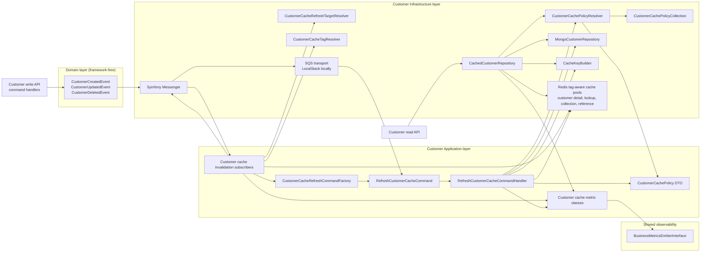

# Architecture: Async Endpoint Cache Refresh

## Current Architecture Fit

The implementation should extend the existing Customer feature directories instead of creating a new `src/Core/Customer/Infrastructure/Cache` bucket:

- Domain events stay in `src/Core/Customer/Domain/Event`.
- Event subscribers stay in `src/Core/Customer/Application/EventSubscriber`.
- Async cache refresh should be modeled as CQRS command flow with `Application/Command` and `Application/CommandHandler`.
- Cache policy data belongs in existing Application and Infrastructure type directories: `DTO`, `Factory`, `Collection`, and `Resolver`.
- The cached repository decorator remains the feature anchor in `Infrastructure/Repository`.
- Existing cache tag helpers remain in `Infrastructure/Collection` and `Infrastructure/Resolver`.
- Shared low-level cache utilities remain in `src/Shared/Infrastructure/Cache`.
- Do not introduce `ReadModel`, `Query`, `Policy`, `Registry`, `Scheduler`, `Message`, or `MessageHandler` directories for this feature unless the current repo already contains and collects those directory types.

This structure follows the repository rule: one directory contains one class type, and planning must prefer existing directory names that are already represented in the source tree and `deptrac.yaml`.

## Architecture Diagram



Read requests continue to use the cache repository decorator. Write-side domain events invalidate affected tags and enqueue `RefreshCustomerCacheCommand` work for same-entity cache refresh. Refresh workers warm customer detail and email lookup cache entries through the inner repository without blocking business writes.

## Planned Source Tree

The implementation PR should add the following source files and edit the listed existing feature files.

```text
src/
  Core/
    Customer/
      Application/
        Command/
          RefreshCustomerCacheCommand.php
        CommandHandler/
          RefreshCustomerCacheCommandHandler.php
        DTO/
          CustomerCachePolicy.php
        EventSubscriber/
          CustomerCreatedCacheInvalidationSubscriber.php (edit)
          CustomerDeletedCacheInvalidationSubscriber.php (edit)
          CustomerUpdatedCacheInvalidationSubscriber.php (edit)
        Factory/
          CustomerCachePolicyFactory.php
          CustomerCacheRefreshCommandFactory.php
        Metric/
          CustomerCacheHitMetric.php
          CustomerCacheMissMetric.php
          CustomerCacheRefreshFailedMetric.php
          CustomerCacheRefreshScheduledMetric.php
          CustomerCacheRefreshSucceededMetric.php
          CustomerCacheStaleServedMetric.php
          ValueObject/
            CustomerCacheMetricDimensions.php
      Infrastructure/
        Collection/
          CustomerCachePolicyCollection.php
          CustomerCacheTagCollection.php (existing)
        Repository/
          CachedCustomerRepository.php (edit)
        Resolver/
          CustomerCachePolicyResolver.php
          CustomerCacheRefreshTargetResolver.php
          CustomerCacheTagResolver.php (existing)
  Shared/
    Infrastructure/
      Cache/
        CacheKeyBuilder.php (existing, edit only for generic key helpers)
```

This layout matches current source and deptrac boundaries:

- `Application/Command`, `Application/CommandHandler`, `Application/DTO`, `Application/EventSubscriber`, `Application/Factory`, and `Application/Metric` are already collected as Application.
- `Infrastructure/Collection`, `Infrastructure/Repository`, and `Infrastructure/Resolver` are already collected as Infrastructure.
- `Shared/Infrastructure/Cache` already exists for shared cache utilities.
- No new Customer `Infrastructure/Cache` directory is needed because cache behavior is part of the existing Customer repository, collection, resolver, and subscriber feature surface.

Planned test files:

```text
tests/
  Unit/
    Customer/
      Application/
        Command/
          RefreshCustomerCacheCommandTest.php
        CommandHandler/
          RefreshCustomerCacheCommandHandlerTest.php
        DTO/
          CustomerCachePolicyTest.php
        EventSubscriber/
          CustomerCreatedCacheInvalidationSubscriberTest.php
          CustomerDeletedCacheInvalidationSubscriberTest.php
          CustomerUpdatedCacheInvalidationSubscriberTest.php
        Factory/
          CustomerCachePolicyFactoryTest.php
          CustomerCacheRefreshCommandFactoryTest.php
        Metric/
          CustomerCacheMetricTest.php
          ValueObject/
            CustomerCacheMetricDimensionsTest.php
      Infrastructure/
        Collection/
          CustomerCachePolicyCollectionTest.php
        Repository/
          CachedCustomerRepositoryPolicyTest.php
        Resolver/
          CustomerCachePolicyResolverTest.php
          CustomerCacheRefreshTargetResolverTest.php
  Integration/
    Customer/
      Infrastructure/
        Repository/
          AsyncCustomerCacheRefreshTest.php
```

Configuration and documentation expected to change:

```text
config/
  packages/
    cache.yaml
    messenger.yaml
  packages/test/
    cache.yaml
    messenger.yaml (new, only if test routing cannot stay in messenger.yaml)
  services.yaml
.env
.env.test
docs/
  advanced-configuration.md
  design-and-architecture.md
  operational.md
  performance.md
```

## Proposed Components

### Cache Policy Model

Add cache policy classes through existing class-type directories:

- `CustomerCachePolicy` in `Application/DTO`
- `CustomerCachePolicyFactory` in `Application/Factory`
- `CustomerCachePolicyCollection` in `Infrastructure/Collection`
- `CustomerCachePolicyResolver` in `Infrastructure/Resolver`

Use services.yaml arguments for TTLs and jitter so defaults are configurable without editing repository code. Avoid separate enum classes in the first implementation unless the implementation already has an existing enum directory pattern to reuse.

### Cache Refresh Command Path

Add a dedicated command model instead of a separate message model:

- `RefreshCustomerCacheCommand` in `Application/Command`
- `RefreshCustomerCacheCommandHandler` in `Application/CommandHandler`
- `CustomerCacheRefreshCommandFactory` in `Application/Factory`
- `CustomerCacheRefreshTargetResolver` in `Infrastructure/Resolver`

The command should carry scalar payload only, such as family name, customer ID, email, and event metadata, so it remains stable across Messenger serialization. Event subscribers create refresh commands after invalidation and dispatch them best-effort through Messenger or the configured command path. The handler warms same-entity entries from persisted state, such as customer detail by ID and lookup by email. For delete events, it should avoid warming deleted entities and may only preserve invalidation behavior.

### Repository Decorator Changes

Update `CachedCustomerRepository` to inject:

- detail cache pool
- lookup cache pool
- policy resolver
- metrics emitter or cache metrics service

Use the policy resolver for TTL, tags, and cache key metadata. Preserve existing `findFresh()` bypass behavior for write paths.

### Messenger Configuration

Add:

- `CACHE_REFRESH_QUEUE_NAME`
- `FAILED_CACHE_REFRESH_QUEUE_NAME`
- `CACHE_REFRESH_TRANSPORT_DSN`
- `FAILED_CACHE_REFRESH_TRANSPORT_DSN`
- `cache-refresh` transport
- `failed-cache-refresh` transport
- routing for `RefreshCustomerCacheCommand`

In `when@test`, route cache refresh to an in-memory transport.

### Observability

Add typed metrics under `src/Core/Customer/Application/Metric`:

- `CustomerCacheRefreshScheduledMetric`
- `CustomerCacheRefreshSucceededMetric`
- `CustomerCacheRefreshFailedMetric`
- `CustomerCacheHitMetric`
- `CustomerCacheMissMetric`
- `CustomerCacheStaleServedMetric`

Place metric dimension value objects under `Application/Metric/ValueObject` so metric classes and value objects do not share one directory.

### Failure Semantics

- Repository cache failures fall back to the inner repository.
- Subscriber dispatch failures log and emit a failure metric, then return.
- Command handler failures log and emit a failure metric, then return so poison refresh jobs do not block business behavior.
- Domain event subscribers remain resilient through the existing `DomainEventMessageHandler`.

## Implementation Sequence

1. Add policy DTO, factory, collection, resolver, and tests.
2. Split cache pools and update repository TTL usage.
3. Add refresh command, command factory, command handler, target resolver, and Messenger routing.
4. Update subscribers to invalidate plus dispatch refresh commands.
5. Add metrics and tests.
6. Add integration proof and docs.
7. Run CI and cache performance evidence.

## Architectural Tradeoffs

- The first PR should not attempt generic API Platform collection caching. That requires a provider-level design and may be a separate architecture change.
- Reference-data policies can be declared before reference-data domain events exist. Full refresh triggering for type/status mutations should be follow-up work unless events are added in this PR.
